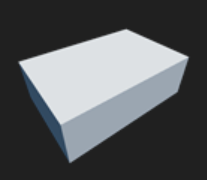
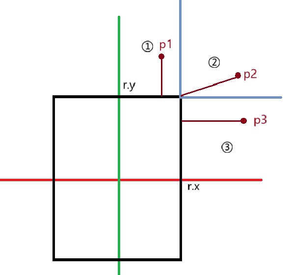

# 各种形状的距离场公式

## 圆形 Sphere


**代码**

```C++
struct sphere{
    vec3 center;
    float r;
}
float sdSphere(vec3 p, sphere s)
{
    return length(p - s.center) - r;
}
```

**推导**

（略）

## 盒子 Box



**代码**

```C++
//在原点
struct box{
    vec3 radius; //x, y, z三个轴上的半径（注意是半径，不是直径）
}

float sdBox(vec3 p, box b)
{
    vec3 ap = abs(p);
    return length(min(p, b.radius) - b.radius);
}
```

**推导**

{width=40%}


