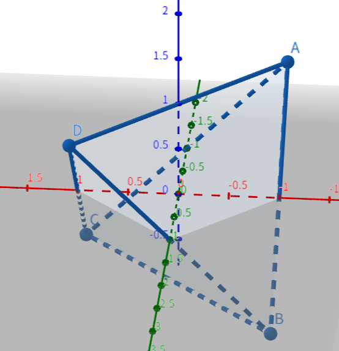

# 获取SDF场景法向量

在基于**SDF**的场景渲染中，我们如何获取通过**SDF**描述的几何表面的法向量？答案是通过数值微分。

## 数学基础

**SDF**是一个距离场函数，在几何表面，是该距离场函数的一个等值面，即**SDF = 0**。下面我们证明：一个等值面上的梯度，是垂直于该等值面的：

对于三维函数$f(x,y,z)$，$S$为其上通过点$p(a,b,c)$的一个光滑等值面，满足$f(x,y,z)=k$。假设$l$为通过点$p$的任意曲线，其参数方程为$x=x(t)$， $y = y(t)$， $z = z(t)$，则满足$f(x(t),y(t),z(t)) = k$. 对$t$求导，根据[链式法则](../../../math/doc/calculus/docs/链式法则.md)，有：

$\frac{\partial{f}}{\partial{x}}\cdot\frac{dx}{dt} + \frac{\partial{f}}{\partial{y}}\cdot\frac{dy}{dt} + \frac{\partial{f}}{\partial{z}}\cdot\frac{dz}{dt} = 0$

写成点积形式：

$(\frac{\partial{f}}{\partial{x}}, \frac{\partial{f}}{\partial{y}}, \frac{\partial{f}}{\partial{z}}) \cdot (\frac{dx}{dt}, \frac{dy}{dt},\frac{dz}{dt}) = 0$

其中$ (\frac{dx}{dt}, \frac{dy}{dt},\frac{dz}{dt}) $是曲线$l$在点$p$的切向量，而$(\frac{\partial{f}}{\partial{x}}, \frac{\partial{f}}{\partial{y}}, \frac{\partial{f}}{\partial{z}})$是函数$f$在点$p$的梯度。因为我们这里是任意曲线，因此可以得到函数的梯度垂直于任何过改点的曲线的切向量。因为一个向量垂直于曲面上的所有切向量当且仅当它垂直于该曲面，所以梯度向量在点$p$处垂直于等值面$S$。

## 做法

基于上面的推导，我们可以知道：只要我们获取某个点的梯度，既可以得到该点的法向量。我们可以通过稍微偏移计算点来计算足够近的两个点的**SDF**值，然后用差值来近似梯度。下面是代码：

```glsl
vec3 calcNormal( in vec3 p ) // for function f(p)
{
    const float eps = 0.0001; // or some other value
    const vec2 h = vec2(eps,0);
    return normalize( vec3(f(p+h.xyy) - f(p-h.xyy),     //x轴
                           f(p+h.yxy) - f(p-h.yxy),     //y轴
                           f(p+h.yyx) - f(p-h.yyx) ) ); //z轴
}
```
上面的代码中使用了*中心微分*计算了6次**SDF**。我们可以采用前向或者后向微分来简化：

```glsl
vec3 calcNormal( in vec3 p ) // for function f(p)
{
    //这里采用了前向微分；另外，因为几何表面SDF=0，因此我们也不用计算f(p)，直接用0
    //这样只需要计算3次即可
    const float eps = 0.0001; // or some other value
    const vec2 h = vec2(eps,0);
    return normalize( vec3(f(p+h.xyy) - 0,   //f(p)     //x轴
                           f(p+h.yxy) - 0,   //f(p),    //y轴
                           f(p+h.yyx) - 0) ) //f(p);    //z轴
}
```

## Tetrahedron Technique



上面为了性能，没有采用中心微分，因为中心微分需要计算6次**SDF**。

这里介绍一个新的技法，基于中心微分，但是仅仅需要计算四次**SDF**即可。

该方法在四个方向($k_1(1,1,1)$，$k_2(1,-1,-1)$，$k_3(-1,1,-1)$以及$k_4(-1,-1,1)$)上求微分，加起来之后单位化就是梯度值了。这四个方向构成了一个三棱锥，所以被称呼为“Tetrahedron Technique”。代码如下——

```glsl
vec3 calcNormal( in vec3 p) // for function f(p)
{
    const float h = 0.0001; // replace by an appropriate value
    const vec2 k = vec2(1,-1);
    return normalize( k.xyy*f( p + k.xyy*h ) +  //(1, -1, -1)
                      k.yyx*f( p + k.yyx*h ) +  //(-1, -1, 1)
                      k.yxy*f( p + k.yxy*h ) +  //(-1, 1, -1)
                      k.xxx*f( p + k.xxx*h ) ); //(1, 1, 1)
}

```

### 证明

最终向量的表达式为：

$m = \sum_i^4 k_if(p + h \cdot k_i)$

下面的式子：

$\sum_i^4 k_if(p) = f(p)\sum_ik_i = 0$

我们将其减到$m$的表达式：

$m = \sum_i^4 k_if(p + h\cdot k_i) - \sum_i^4 k_if(p) = \sum_i^4k_i(f(p + h\cdot k_i) - f(p))$

其中$f(p+h\cdot k_i) - f(p)$就是函数$f$在方向$k_i$的方向梯度。

根据[方向梯度](../../../math/doc/calculus/docs/gradient.md)的定义，有

$f(p+h\cdot k_i) - f(p) \approx k_i\cdot \nabla f(p), h\to 0$

于是原式子有：

$m =  \sum_i^4k_i(f(p + h\cdot k_i) - f(p)) = \sum_i^4k_i\cdot k_i \cdot \nabla f(p) = \nabla f(p)\sum_i^4 (k_i\cdot k_i) = 12\nabla f(p)$

单位化之后就是$\nabla f(p)$了。