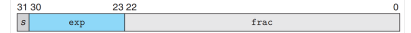
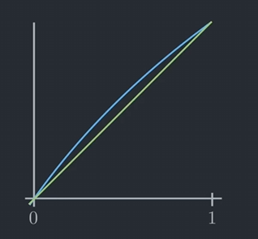
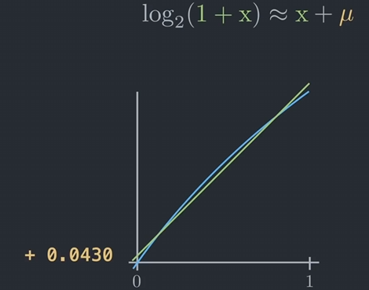
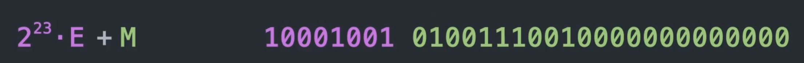

# 快速平方根倒数算法

这个算法是在雷神之锤3游戏引擎中使用的，用来快速近似精算平方根倒数$ \frac{1}{\sqrt{x}}$.这个计算会大量用在对向量进行归一化的地方——$\frac{1}{\sqrt{x^2 + y^2 + z^2}}$.

## 代码

下面是相关的代码：

```C++
float Q_rsqrt(float number)
{
    long i;
    float x2, y;
    const float threehalfs = 1.5f;
    
    x2 = number * 0.5f;
    y = number;
    i = *(long *) &y; //evil floating point bit hack
    i = 0x5f3759df - (i >> 1); //what the fuck?
    y = * ( float* ) &i;
    y = y * (threehalfs - ( x2 * y * y) ); //1st iteration
//  y = y * (threehalfs - (x2 * y * y) ); //2nd iteration, can be removed
    return y;

}

```

## 解释

开头3行代码很好理解：
- 声明32-bit数字`i`
- 声明两个32-bit数字`x2`和`y`
- 声明一个32-bit的值`threehalfs`，值为$\frac{1}{3}$

在继续讲下面的步骤前，需要先了解32-bit数值在计算机中的表达方式——

### 32-bit数字

#### 整形

32-bit整形的结构很简单：第一位是符号位，后面的31-bit是数值位

### 浮点数

32-bit浮点数使用的是**IEEE 754**标准。标准规定：

在32-bit中：
- 第1位是符号位；
- 后面8位定义了指数，表示的是$2^n$；但是指数包括负数，因此要减去127，即实际表示的指数值为$2^n-127$.
- 最后23位是尾数，表示的是1-2之间的一个值（有一个被省去的始终为1的位）



整体而言，假设尾数部分看作整数时候的值为$M$，指数部分的值为$E$，则表达是的数值为

$(1 + \frac{M}{2^{23}}) \times 2^{E-127}$

> 这里$1 + \frac{M}{2^{23}}$类似于十进制下，$1.245 = 1 + \frac{245}{2^{-3}}$

我们这里将这个表达式取2为底的对数:

$\log_2{(1 + \frac{M}{2^{23}}) \times 2^{E-127}}$

$=log_2{(1 + \frac{M}{2^{23}})} + log_2{(2^{E-127})}$

$=log_2{(1 + \frac{M}{2^{23}})} + E - 127$

这里，我们利用极限，$log_2{(1 + x)}\approx x$，实际上，在0~1范围内，两者图像为：



在0和1处，这个近似是精确的。不过在非0或者1处，我们需要引入一个修正项$\mu$，即

$log_2{(x+1)} \approx x + \mu$.

这个修正项我们可以随意选择，不过事实证明，将$\mu$设置为$0.0430$的时候，平均误差最小：



我们引入这个近似，将原先的公式近似为：

$log_2{(1 + \frac{M}{2^{23}})} + E - 127$

$\approx \frac{M}{2^{23}} + \mu + E - 127$

$=\frac{1}{2^{23}}(M + 2^{23}\times E) + \mu - 127$

这里出现了$2^{23}\cdotp E + M$，正好是原本浮点数的整形表示。换句话说，**一个32-bit浮点数的整形解析，可以表达为该浮点数的以2为底的对数的缩放和偏移——**



换句话说，我们对浮点数进行上面的这种解析，进行缩放和加减偏移之后，得到的是原本浮点数的一个对数$log_2(x)$.


### 算法步骤

#### *"Evil Bit Hack"*

```C++
i = *(long *) & y;
```

这一步骤的目的是将浮点数`y`的位（即需要计算的`number`）原封不动地放入到整形`i`中。

#### *"What the Fuck"*

```C++
i = 0x5f3759df - (i >> 1);
```

如果我们对一个数的指数进行位移操作，左移会翻倍；右移会取平方根，这个时候取反的话会得到倒数平方根：

$x^n$，$n$左移：$x^{2n}$

$x^n$，$n$右移：$x^{n/2}$，取反，$x^{-n/2}$

我们需要计算的是`1 / sqrt(y)`。这里`i`经过第一步之后，存储的是`number`的对数。

我们不直接计算$\frac{1}{\sqrt{y}}$，而是计算$\log_2{(\frac{1}{\sqrt{y}})}$——

$\log_2{\frac{1}{\sqrt{y}}} = \log_2{(y^{-\frac{1}{2}})} = -\frac{1}{2}\log_2{y}$

其中，乘以$-\frac{1}{2}$可以通过右移来实现，即`-(i >> 1)`.

但是显然`i`存放的不是$-\frac{1}{2}\log_2{y}$的值，因为将`float`作为`int`解析之后，得到的是一个经过偏移和缩放的对数值:
$\frac{1}{2^{23}}(M + 2^{23}\times E) + \mu - 127$

因此我们需要列出下面这个方程：

设$\Gamma = \frac{1}{\sqrt{y}}$，则

$\log_2{\Gamma} = -\frac{1}{2}\log_2{y}$，则

$\frac{1}{2^{23}}(M_{\Gamma} + 2^{23}\times E_{\Gamma}) + \mu - 127 = -\frac{1}{2}(\frac{1}{2^{23}}(M_y + 2^{23}\times E_y) + \mu - 127)$，化简之后得到：

$(M_{\Gamma} + 2^{32}\times E_{\Gamma}) = \frac{3}{2}2^{23}(127-\mu) - \frac{1}{2}(M_y + 2^{23}\times E_y)$，

其中$\frac{3}{2}2^{23}(127-\mu)$值为`0x5f3759df`。因此等式右边等于`0x5f3759df - (i >> 1);`。

然后我们将这个整形重新解析为`float`就可以得到结果了：`y = * ( float * ) & i;`。

但是这不是精确解，只是一个相当不错的精确值。我们在这里引入牛顿法，快速迭代到一个新的近似值。

#### *"Newton Iteration"*

我们已经拿到了一个足够优秀的近似值，我们可以在这个基础上引入牛顿迭代。

这里要明确我们需要求的是什么：我们在已知$x$的情况下，需要求解$y=\frac{1}{\sqrt{x}}$的值。

> 这里很容易搞错。牛顿迭代法求的是根，一般是已知$y_0$，求解$x_0$，使得$f(x_0) - y_0 = 0$；但是这里是已知$x_0$，求解$y_0 = \frac{1}{\sqrt{x_0}} = ?$

我们调整公式为$f(y) = x - \frac{1}{y^2} = 0$，求解 $y_0$，使得当$x =$ `number`的时候，等式成立。

$f'(y) = \frac{2}{y^3}$

$\frac{f(y)}{f'(y)} = \frac{1}{2}(xy^3-y)$

我们已经通过前面的步骤得到一个近似值$y_0$，因此我们代入进行迭代：

$ y_1 = y_0 - \frac{f(y)}{f'(y)} = y_0 - \frac{1}{2}(xy_0^3-y_0) = \frac{3}{2}y_0 - \frac{1}{2}x_0y_0^3$ 

正是代码中的表达式`y = y * (threehalfs - ( x2 * y * y) );`

