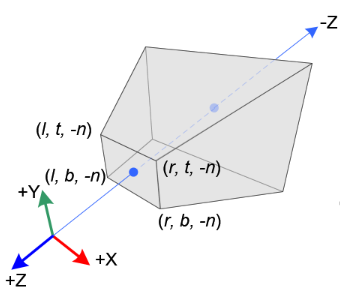
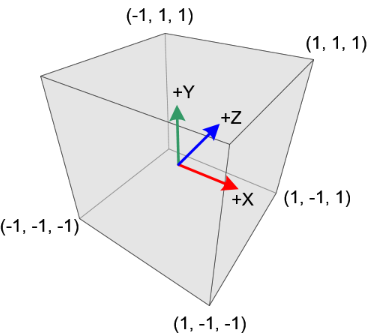
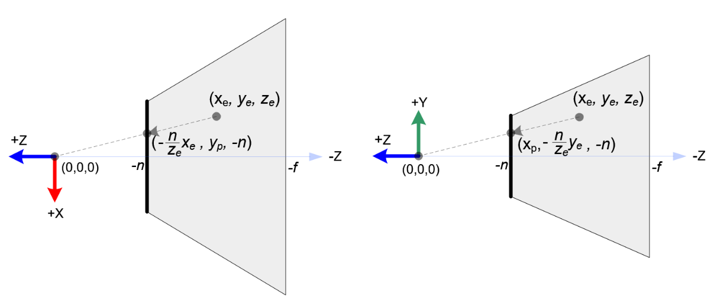
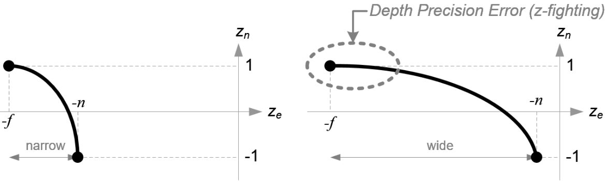

# 投影矩阵

投影矩阵有两个不同的类型：符合近大远小关系的透视投影（projection）和保持平行关系的正交投影（orthogonal）。这篇笔记主要是推导相关矩阵。

>注意，下面的推导中,$l$、$r$表示的是近平面的左右两端坐标，带符号；$t$、$b$表示的是近平面的上下两端坐标，带符号；而$f$和$n$表示的是近平面距离和远平面距离，不带符号。

## 一、视图坐标空间和NDC坐标空间

视图坐标空间**view**采用的是右手坐标系；


而NDC坐标空间采用的是左手坐标系。这意味着，在NDC盒子中，近平面的点的`z`值等于-1。但是NDC坐标下的`z`不会直接用作深度值，还需要将$[-1,1]$范围内的值映射到$[0,1]$。



## 二、透视投影

### 2.1 推导

> 透视投影的推导看了非常多遍，但是经常记不住。这里通过几个要点/步骤来推导，帮助记忆——只需要记住这几个要点的含义即可

###### 要点1：距离的缩放影响

**顶点到相机的距离会对`x`、`y`两个分量产生缩放影响。**

在从clip空间变换到NDC空间的时候，需要对`x`、`y`进行坐标缩放，这个缩放因子显然和顶点在视图空间下到相机的距离是逆相关的。下面的推导能体现这一点。



$x_p = \frac{-n}{z_e}\cdot x_e =  \frac{n}{-z_e}\cdot x_e$

$y_p = \frac{-n}{z_e}\cdot y_e = \frac{n}{-z_e} \cdot y_e$

> 这里将负号移动到分母是因为这样的话$n$和$-z_e$都是正数

这一步缩放是在从clip空间变换到NDC空间的过程中完成的；因为从clip空间变换到NDC空间主要进行的动作是除以$w_c$，因此这里我们可以推断得到$w_c = -z_e$，也就得到投影矩阵的最后一行是$[0, 0, -1, 0]$——

\[
\begin{bmatrix}
x_c \\ y_c \\ z_c \\ -z_e
\end{bmatrix} = 
\begin{bmatrix}
. & . & . & . \\
. & . & . & . \\
. & . & . & . \\
0 & 0 & -1& 0 \\
\end{bmatrix}
\cdot
\begin{bmatrix}
x_e \\ y_e \\ z_e \\ 1
\end{bmatrix}
\]

###### 要点2：计算$x_p$到$x_n$

我们将投影之后的坐标$x_p$和$y_p$线性缩放到NDC空间———

$\frac{x_p - l}{r - l} = \frac{x_n - (-1)}{1 - (-1)} \implies x_n = \frac{2}{r - l}x_p - \frac{r + l}{r - l}$

$\frac{y_p - l}{t - b} = \frac{y_n - (-1)}{1 - (-1)} \implies y_n = \frac{2}{t - b}x_y - \frac{b + t}{t - b}$

根据前面

$x_p = \frac{-n}{z_e}\cdot x_e =  \frac{n}{-z_e}\cdot x_e$

$y_p = \frac{-n}{z_e}\cdot y_e = \frac{n}{-z_e} \cdot y_e$

我们代入之后可得到$x_e \to x_n$、$y_e \to y_n$的表达式：

$x_n = \frac{(\frac{2n}{r-l}x_e + \frac{r+l}{r-l}z_e)}{-z_e}$

$y_n = \frac{\frac{2n}{t - b}y_e + \frac{t+b}{t-b}z_e}{-z_e}$

> 这里我们提取一个$-z_e$的分母项，因为最终从clip $\to$ NDC需要除以$w_e$(即$-z_e$)

由此我们可以得到矩阵的第一、二行：

\[
\begin{bmatrix}
x_c \\ y_c \\ z_c \\ -z_e
\end{bmatrix} = 
\begin{bmatrix}
\frac{2n}{r-l} & . & \frac{r+l}{r-l} & 0 \\
. & \frac{2n}{t-b} & \frac{t+b}{t-b} & 0 \\
. & . & . & . \\
0 & 0 & -1& 0 \\
\end{bmatrix}
\cdot
\begin{bmatrix}
x_e \\ y_e \\ z_e \\ 1
\end{bmatrix}
\]

###### 要点3：$z_c$与$x_e$、$y_e$无关

很显然，$z_c$项是和$x_e$、$y_e$无关的，因此我们可以假设矩阵第四行是：

\[
\begin{bmatrix}
x_c \\ y_c \\ z_c \\ -z_e
\end{bmatrix} = 
\begin{bmatrix}
\frac{2n}{r-l} & . & \frac{r+l}{r-l} & 0 \\
. & \frac{2n}{t-b} & \frac{t+b}{t-b} & 0 \\
. & . & A & B \\
0 & 0 & -1& 0 \\
\end{bmatrix}
\cdot
\begin{bmatrix}
x_e \\ y_e \\ z_e \\ 1
\end{bmatrix}
\]

我们可以代入$P_p[0,0,-n] \to P'_n[0, 0, -1]$和$Q_p[0,0,-f] \to Q'_n[0,0,1]$两点进去，列出一个方程组——

\[
\begin{cases}
\frac{A\cdot -n + B}{n} = -1 \\
\frac{A\cdot -f + B}{f} = 1
\end{cases}
\]

最终解得：

\[
\begin{cases}
A = -\frac{f+n}{f-n} \\
B = -\frac{2fn}{f-n}
\end{cases}
\]

因此，最终的投影矩阵为：

\[
\begin{bmatrix}
x_c \\ y_c \\ z_c \\ -z_e
\end{bmatrix} = 
\begin{bmatrix}
\frac{2n}{r-l} & . & \frac{r+l}{r-l} & 0 \\
. & \frac{2n}{t-b} & \frac{t+b}{t-b} & 0 \\
. & . & -\frac{f+n}{f-n} & -\frac{2fn}{f-n} \\
0 & 0 & -1& 0 \\
\end{bmatrix}
\cdot
\begin{bmatrix}
x_e \\ y_e \\ z_e \\ 1
\end{bmatrix}
\]

### 2.2 步骤总结

计算透视投影的三个步骤：

- 距离产生缩放，因此第四行为$[0,0,-1,0]$
- 通过$x_e\to x_n$、$y_e\to y_n$的变换关系，求出第1、2行
- 因为$z_c$与$x_c$、$y_c$无关，假设第3行为$[0,0,A,B]$，代入顶点$[0,0,-n,1]$、$[0,0,-f,1]$求解A、B

### 2.3 关于透视投影补充

#### （1）clip $\to$ NDC除以的$w_c$实际上等于$-z_e$

这是透视“近大远小”这个天然属性决定的。这个细节可以帮助我们构造近平面的顶点：我们令`gl_Position = [-n, -n, -n, n] | [-n, n, -n, n] | [n, -n, -n, n] | [n, n, -n, n]`来构造覆盖近平面的四个顶点。下面给出相关代码：

```glsl
//vertex
uniform float zNear;

const vec4 vertices[] = vec4[](
	vec4(zNear,  zNear, -zNear, zNear),
	vec4(zNear, -zNear, -zNear, zNear),
	vec4(-zNear,-zNear, -zNear, zNear),
	vec4(-zNear, zNear, -zNear, zNear)
);
const int indices[] = int[](
	0,3,2,0,2,1
);
void main(void)
{
	gl_Position = vec4(vertices[indices[gl_VertexID]]);
}
```

```glsl
//fragment

//frag_coord = gl_FragCoord.xy
vec3 gen_camera_ray_in_view(vec2 frag_coord_xy, float near, vec2 resolution, mat4 invProj)
{
	vec3 res;
	vec2 ndc_xy = (2.0 * frag_coord_xy / resolution - 1.0);
	vec3 ndc = vec3(ndc_xy, -1.0);
	vec4 clip = vec4(ndc * near, near);
	res = vec3(invProj * clip);
	return res;
}

```

#### （2）深度值非线性

根据NDC中的深度值（不是实际的深度值，在$[-1,1]$范围内，需要缩放到$[0,1]$才作为深度值）$z_n$的表达式为：

\[
z_n = \frac{-\frac{f+n}{f-n}\cdot z_e - \frac{2fn}{f-n}}{-z_e}=\frac{2fn}{f-n}\cdot \frac{1}{z_e} + \frac{f+n}{f-n}
\]

很显然，$z_n$和$z_e$之间不是线性关系。下面的图显示了这一点：




## 三、正交投影