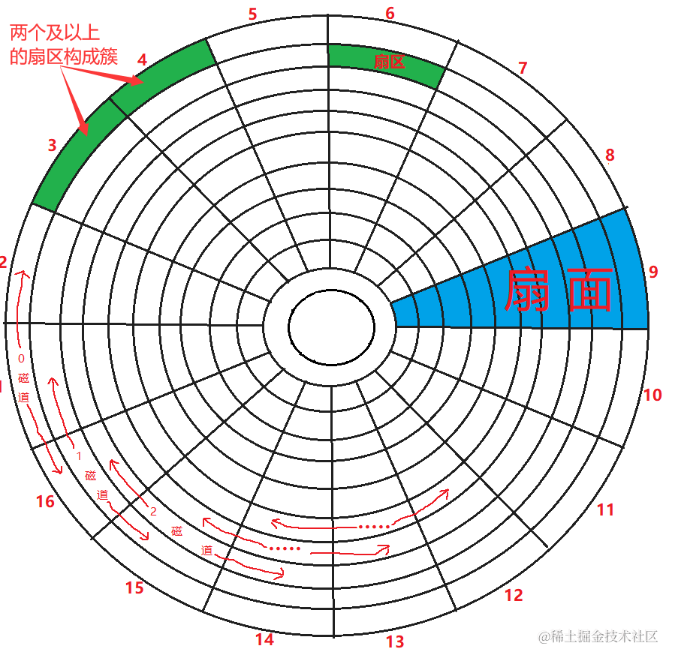
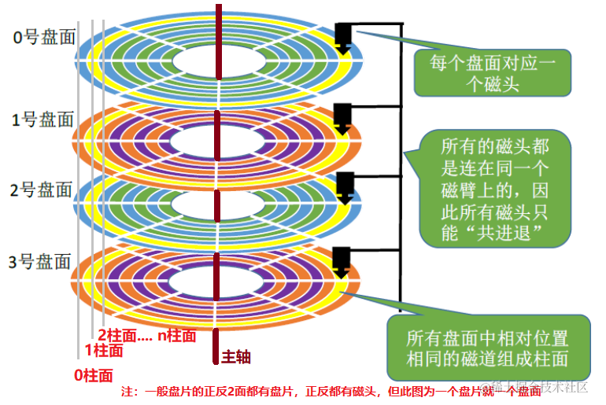

# 计算机概论 

## 一、电脑 

### 1.1 CPU的架构 

目前世界上最常见的有两种CPU架构, 分别是精简指令集(RISC)与复杂指令集(CISC):

- **精简指令集(Reduced Instruction Set computer, RISC)** 

这种CPU的设计中，指令集较为精简，每个指令的运行时间都很短，完成的操作也很简单，指令的执行性能较佳，如果要做复杂的事情则需要多个指令来完成。常见的RISC指令集cpu主要有：

    - Oracle公司的SPARC系列
    - IBM的Power Architecture（包括PowerPC）: PS3
    - ARM的ARM cpu系列 : 手机、平板等

- **复杂指令集(Complex Instruction Set Computer, CISC)**

这种CPU的设计中, 指令集的每个小指令可以执行一些较低级的硬件操作, 指令数目多而复杂, 每条指令的长度也不相同。因为指令执行较为复杂，所以每条指令花费的时间较长。

    - AMD、Intel、VIA等设计的x86架构

> **为什么叫X86架构?** 因为最早的那块英特尔研发出来的CPU代号称为8086，后面依此架构又开发出80286,80386等。

### 1.2 CPU

#### 1.2.1 CPU的工作频率：外频与倍频

**外频**: 指的是CPU与外部组件进行数据传输时的速度
**倍频**: 指的是CPU内部用来加速工作性能的一个倍数 

两者的乘积才是CPU的频率速度.

> **超频** 指的是将CPU的倍频或者外频通过主板提供的设置功能更改为较高频率的一种方式. 因为CPU的倍频通常是在出厂的时候已经锁死,所以通常被超频的是外频 .

#### 1.2.2 32位与64位的CPU与总线"位宽"

CPU与内存之间的数据传输需要CPU中的内存控制芯片，而内存控制芯片也有一个工作频率.

**位宽**：指的是每个时钟周期能够传输的数据量，大多为64位
**带宽**：内存控制芯片的工作频率乘以位宽就是带宽，例如1600MHz的内存控制芯片加上64位的位宽，带宽就是 1600MHz * 64bit = 12.8GHz.
**字长**：word size,指的是CPU每次能够处理的数据量长度

#### 1.2.3 CPU等级

- i586: Intel Pentium MMX, AMD K6年代
- i686: Intel Celeron, AMD Athlon(K7)年代之后的32-bitCPU
- x86-64: 目前的64-bit CPU

新一代的CPU具有向下兼容的能力, 例如x86-64硬件上可以安装i386程序

### 1.3 内存

个人电脑的内存主要组件为动态随机存取内存(Dynamic random access memory, DRAM).

DRAM根据技术的更新又分为好几代,使用较为广泛的有SDRAM与DDR SDRAM. 其中DDR是所谓的双倍数据传输速度(Double Data Rate), 它可以在一次工作周期中进行两次数据的传输.

> **SDRAM的's'代表的是什么？**：代表的是同步(synchronous). 这是因为它的工作节拍受到外部时钟信号的统一调度 .

> **什么是DDR3L** 有时候内存规格会提到DDR3/DDR3L同时支持。这里的DDR3L指的是更低工作电压的DDR3, DDR3的标准电压为1.5V, 但是DDR3L仅需要1.35V.

#### 1.3.1 多通道设计 

传统的设计下, 总线位宽一般仅为64位 ,但是我们可以开启双通道 .双通道的做法是增加一条独立的总线 ,这样的话CPU就可以将两条独立的64位单通道组合成一条逻辑上的128位的单通道 ,这样一来位宽就翻倍了 .

#### 1.3.2 DRAM与SRAM

现代CPU架构中为了加速内存访问, 一般都会在CPU内部集成缓存 ,一般常见的有L1缓存L2缓存等 ,CPU与这些缓存之间的数据交换不需要经过总线 ,因此速度会非常快 .但是DRAM的速度无法满足 ,因此需要 **静态随机存取内存 (Static random access memory ,SRAM)** 的帮忙。

#### 1.3.3 只读存储器 (ROM)

计算机启动的时候需要为每一个硬件配置启动参数 ,这些参数是被记录在一个名为CMOS的芯片中 ,这个芯片需要借助额外的电源来使用记录功能 .读取和更新CMOS芯片中的参数需要使用一个叫做BIOS的程序，这个程序被写死在主板上面的一个存储芯片中 ，在没有充电也能够记录数据 ，这就是只读存储器 （Read Only Memory ）。 

> **固件** 固件可以简单的理解为固定在硬件上面的控制软件 ，BIOS就是一种固件 。

### 1.4 显卡

显卡又被成为VGA（Video Graphics Array），主要用于游戏等渲染。

显卡与主板连接传输的规格主要按照下面的顺序发展：

- PCI
- PCI 2.2
- PCI-X
- AGP 4x
- AGP 8x
- PCIe 1.0
- PCI2 2.0
- PCIe 3.0
- PCIe 4.0

> PCIe : PCI-Express。这种接口采用管道的概念来处理，管道越多则总带宽越高。我们称这些管道为通道。常见的有x1通道、x8通道以及x16通道。

显卡画面输出接口的规格分为以下几类：

- D-sub(VGA): 早期针对CRT显示器的接口，仅能传输影像
- DVI: 常见于液晶屏幕连接，仅能传输影像
- HDMI: 除了传输影像还能传输声音
- DisplayPort: 除了能传输影像还能传输声音
  
### 1.5 磁盘与存储设备

#### 1.5.1 磁盘的物理组成

- 碟片
- 磁头
- 主轴马达
- 机械手臂

#### 1.5.2 传输接口

- **SATA接口**

直到2015年，SATA接口已经发展到了第3代，理论速度上线是600MB。

- **SAS接口**

SAS(Serial Attached SCSI) 是早期SCSI接口的改良版。

- **USB接口**

USB目前已经发展到了第三代，USB 3.1的理论速度上线达到1000MB/s。

### 1.5.2 **固态硬盘**

固态硬盘使用的闪存，能够直接读取数据，不需要像机械硬盘那样旋转磁头定位。

### 1.6 扩展卡与接口

主板通常会预留多个扩展接口的插槽，按照规格通常会包括PCI, AGP, PCI-X, PCIe等。

#### 1.6.1 多通道卡安装在少通道也可以使用

前面说过，PCIe支持不同的通道数量。但是有时候我们会发现：仅仅支持16通道的CPU所在主板，提供了3个x16通道插槽。这是为什么？

原因是外观x16的PCIe插槽可能是电路上仅仅支持x4通道。PCIe支持高通道的设备接入到低通道数的插口，这样的话速度会降至接口通道速度。

### 1.7 主板

主板主要负责各个电脑组件之间的通信。为了精准和目标组件通信，需要使用IO地址和IRQ。

#### 1.7.1 IO地址

IO地址可以理解为IO设备的门牌号。

#### 1.7.2 IRQ中断

IRQ中断负责将设备状况告知CPU，方便CPU进行工作任务分配。一般主板上的IRQ数量是有限的，如果有过多的设备的话，需要将空闲的设备关闭，空出IRQ。

#### 1.7.3 CMOS和BIOS

CMOS主要功能是记录主板上面的重要参数，包括：

- 系统时间
- CPU电压与频率
- 各项设备的IO地址与IRQ

CMOS需要主板上的单独电池供电。

BIOS(Basic Input Output System)则是写入到主板上某一块闪存或者EEPROM的程序，在计算机启动时候执行，加载CMOS参数，并且调用存储设备中的引导程序进入操作系统。
