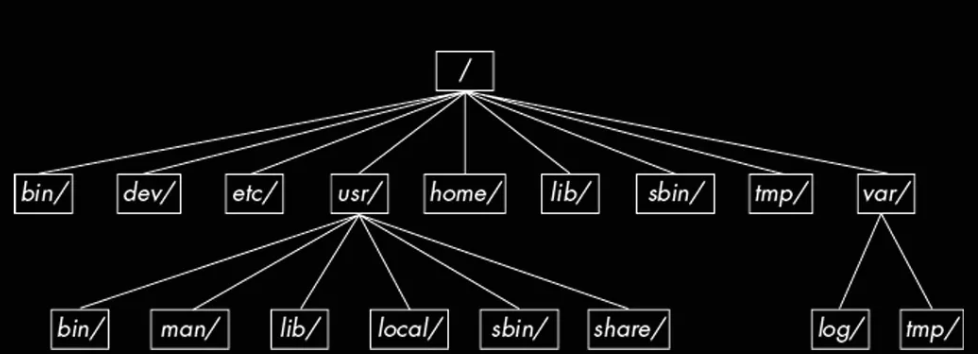

# 磁盘分区

## 一、各硬件设备在Linux中的文件名

> Linux下，几乎所有的硬件设备文件都在`/dev`这个路径下。

|设备|设备在Linux下的文件名|解释|
|:-:|:-:|:-|
|SCSI、SATA、USB磁盘驱动器|/dev/sd[a-p]|sd: SCSI device|
|U盘|/dev/vd\[a-p\] (与SATA相同)||
|Virtio接口|/dev/vd\[a-p\]||
|软盘驱动器|/dev/fd\[0-7\]|floppy disk|
|打印机|/dev/lp\[0-2\](25针打印机) /dev/usb/lp\[0-15\](USB打印机)|Line Printer|
|鼠标|/dev/input/mouse\[0-15\](通用) /dev/psaux (PS/2接口)  /dev/mouse(当前鼠标)||
|CD-ROM、DVD-ROM|/dev/scd\[0-1\](通用) /dev/sr\[0-1\](通用) /dev/cdrom(当前CD-ROM)|scd: SCSI cd,  sr : SCSI rom|
|磁带机|/dev/ht0(IDE接口) /dev/st0(SATA/SCSI接口) /dev/tape(当前磁带)

> **什么是SCSI?** Small Computer System Interface，是一套外围设备和计算机进行数据交换的标准。

## 二、磁盘分区

### 2.1 磁盘连接方式与设备文件名的关系

目前个人计算机常见的磁盘接口有两种：SATA和SAS。更老旧的计算机可能存在IDE接口，不过目前大部分Linux发行版已经将IDE接口设备名字模拟成SATA一样。

虚拟机环境中，可能会使用/dev/vd[a-p]这种文件名。

由于SATA、USB、SAS等磁盘接口使用的都是SCSI模块驱动，因此统一命名为\dev\sd[a-p]格式。至于具体后缀字符是a-p的哪一个，则取决于内核检测到的顺序来命名。

### 2.2 MBR(MS-DOS)与GPT磁盘分区表

机械硬盘由碟片、机械手臂、磁头和主轴马达组成，数据被写入到碟片上面。

碟片上又可细分为**扇区（Sector）**和**磁道（Track）** 两种单位。其中，扇区的物理大小有两种设计，一种是512字节一种是4K字节。

整块磁盘的第一个扇区特别重要，因为它记录了整个磁盘的重要信息。

早期第一个扇区存储的重要信息是 **MBR（Master Boot Record）** 格式的。不过最近由于磁盘的容量不断扩大，使用MBR已经无法进行划分，因此后来设计了新的分区格式 **GPT（GUID partition table）** 。

#### 2.2.1 MBR格式

早期Linux系统为了和Windows的磁盘兼容，采用了支持Windows的MBR方式来处理启动引导程序和分区表。这种方式下，这两个重要的数据统统放在磁盘的第一个扇区。旧的磁盘扇区大小都是512字节，因此，划分为：

- **主引导记录（Master Boot Record，MBR）** ：安装启动引导程序的地方，446字节
- **分区表（partition table）** ：记录整个硬盘分区的状态，64字节

64个字节的分区表中最多只能有四组记录区，每组记录区记录了该分区的起始和结束的 **柱面号码**。当我们将磁盘分区之后，文件名字后面会添加1、2序号。例如对于`/dev/sda`磁盘，划分为4个分区之后，每个分区的文件名字为：`/dev/sda1`，`/dev/sda2`，`/dev/sda3`，`/dev/sda4`。

由此可知：

- **所谓的“分区”其实就是对编辑第一个扇区的64字节**
- **磁盘默认的分区表只能写入四组分区信息**
- **分区的最小单位是柱面**

##### 2.2.1.1 扩展分区

MBR格式下，我们只能添加四组分区。但是我们可以引入扩展分区来添加更多分区。

四组分区可以是以下两种之一：

- 主分区 （Primary）
- 扩展分区 （Extended）

所有四个分区中，**扩展分区只能存在一个**。MBR中记录扩展分区的表项记录的是扩展分区的起始扇区和容量等信息。在扩展分区中可以建立新的**逻辑分区**。会有少量扇区（EBR，扩展引导记录）位于逻辑扇区的开头，并且彼此之间构成链表结构。我们不能直接格式化扩展分区，因为这样会删除逻辑分区的信息，我们只能格式化逻辑分区。

> 逻辑分区的序号从5开始，即`/dev/sda5`，`/dev/sda6`。因为前面四个序号是预留给四个主分区的。

##### 2.2.1.2 MBR格式的限制

由于MBR中留给分区表的大小只有64字节，而每个分区表项需要16字节，因此最多只能有4个分区。

此外，因为MBR使用的是32位逻辑块地址（Logic Block Address, LBA），每个逻辑块是一个扇区，一个扇区的大小（旧）标准是512字节，因此总共只能寻址 $2^{32} * 512=2T$。

> 扇区的标准大小是512字节，不过后面有高达4K大小的扇区。因此使用LBA逻辑概念来表示一个扇区。

而且MBR特别容易损坏：如果第一个扇区出现故障，则所有分区记录全部丢失。

#### 2.2.2 GPT(GUID partition table)分区

GPT分区方法下，整个磁盘不是按照柱面划分，而是直接按照LBA来进行规划。

与MBR不同的是，GPT使用34个LBA来记录分区信息；此外，GPT除了使用前面34个LBA记录分区外，还会在整个磁盘的末尾用34给LBA进行备份。

上图中：

- LBA0：MBR兼容分区。也是分为两个部分，一个是446字节存放启动引导程序；第二个64字节的部分则没有存放分区表，而是用一个特殊的标志标记此磁盘为GPT磁盘。

- LBA1：记录了分区表本身的位置和大小、备份用的GPT分区放置的位置，同时还有校验码（CRC32）

- LBA2-33：实际记录分区的地方。每个LBA可以记录4个分区，因此一共可以记录32x4=128组分区。

#### 2.2 启动流程中的BIOS和UEFI

前面说过，在第0号扇区中或者GPT中的LBA0中，会有446字节存放启动引导程序。这个启动引导程序是怎么执行的？

##### 2.2.1 BIOS+MBR/GPT

计算机启动之后，固定会执行BIOS程序。BIOS程序会访问硬盘，并且到硬盘中去读取第一个扇区的MBR位置(或者GPT的LGA0)，执行MBR中的启动引导程序。

**启动引导程序的功能是加载内核**。启动引导程序是操作系统安装的时候写入的，因此它认识硬盘内的文件系统格式，能够定位内核文件。

> MBR中的启动引导程序只有446字节的空间，如果功能比较大的话，显然是存放不下的，例如grub引导程序，会调用其他程序。这些程序会存放在一个“BIOS boot”分区。一般来说这个分区大小为2M。

##### 2.2.2 多重引导

MBR中的启动引导程序主要有下面3个功能：

- 加载内核文件
- 提供选项：让用户选择不同的启动选项，这是多重引导的功能之一
- 转交其他启动引导程序：将启动管理功能转交给其他启动引导程序负责

其中第2和第3个功能就是多重引导的组成功能。

关于第三点：**我们的电脑有多个启动引导程序吗？**

答案是肯定的。每个分区都有一个启动扇区（boot sector）。这些启动扇区可以用来存放其他启动引导程序。MBR中的启动引导程序可以将控制权转移给这些启动引导程序，从而可以启动其他操作系统。而功能2就是让用户选择执行哪个启动引导程序。

> **我们应该先安装windows在安装Linux**。这是因为Linux的启动引导程序可以选择安装在MBR或者其他分区的启动扇区，同时支持添加选项，这样的话用户可以选择启动Linux还是Windows。而Windows的做法是强制覆盖MBR以及它所在的分区的启动扇区。这样的话MBR只能启动Windows了。如果我们的安装顺序是Windows在后，我们可以想办法恢复MBR即可。

##### 2.2.3 UEFI

BIOS无法识别GPT，因此GPT分区下LBA0必须是BIOS兼容的。现代计算机一般用UEFI这个固件取缔了BIOS。UEFI能够直接识别GPT，并且支持安全启动。同时，UEFI支持legacy模式启动，在不支持UEFI的机器上模拟BIOS。

### 2.3 Linux目录与磁盘分区挂载

#### 2.3.1 目录树结构

Linux下所有数据都是以文件形式呈现。而整个Linux系统又将各个文件路径组织成了一颗目录树。

#### 2.3.2 挂载

**挂载(mount)** 是指利用某个目录作为入口，将磁盘分区放置在该目录下。

Linux下的根目录`/`肯定需要挂载到某个分区；其他路径用户可以自己决定挂载到哪个分区。
