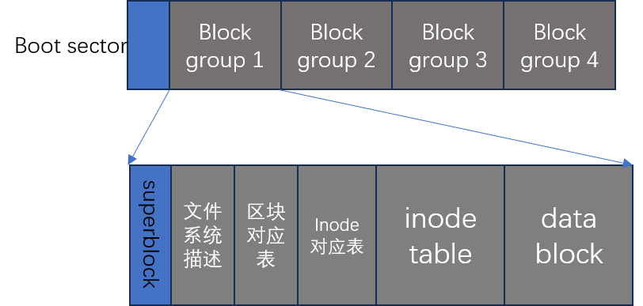

# Linux磁盘与文件系统管理

## 一、认识Linux文件系统

### 1.1 磁盘组成与分区

整块磁盘的主要组成部分：

- **碟片**：主要记录数据的部分
- **机械手臂与机械手臂磁头**：擦写碟片上的数据
- **主轴马达**：控制机械手臂
- **扇区**：最小的物理存储单位，目前主要有512B和4KB两种大小格式
- **柱面**：不同盘片的同一个磁道构成的一个圆柱面

早期的分区主要以柱面为最小分区单位，现在的分区通常使用扇区为最小分区单位（每个扇区都有号码）。

磁盘分区表主要有两种格式：

- MBR：第一个分区最重要，里面有主引导记录（MBR）以及分区表
- GPT：除了分区数量扩充较多之外，支持的磁盘容量也超过2TB

在Linux下面，磁盘分区的命名为：

- `/dev/sd[a-p][1-128]`: 物理磁盘的文件名
- `/dev/vd[a-p][1-128]`: 虚拟磁盘的文件名
  
### 1.2 文件系统特性

为什么要进行文件系统的格式化？这是因为不同操作系统使用的文件系统不同，因此需要将文件的格式转化为新的操作系统能够读懂的格式。

Windows98之前使用的文件系统是FAT（或FAT16），Windows 2000之后的版本使用的是NTFS文件系统。

Linux的正版文件系统则为ext2（Linux second Extended file system, ext2fs）。

传统情况下，一个分区只能格式化为一个文件系统，但是后面新的技术支持在一个分区下划分多个文件系统。因此后面说格式化的时候不是说“格式化一个分区”，而是“格式化一个文件系统”。

Linux下，一个文件除了文件实际内容外，还有其他的属性，例如文件拥有者、用户组等。这些信息和文件实际内容会被分开存放：前者放置在inode中，而实际数据则放置在数据区块中。

另外，还有一个超级区块（superblock）会记录整个文件系统的整体信息，例如inode与数据区块的总量、使用量、剩余量，以及文件系统的格式与相关信息等。

文件实际的数据内容会存放在**数据区块**中。如果一个文件太大，会分散在多个数据区块。

每个文件对应一个inode，而inode则记录了文件所存放的数据区块的编号。找到inode之后，我们可以立即定位到文件所使用的数据区块索引，因此可以快速获取到文件内容。这种数据存取方法我们称为**索引式文件系统**。

和索引式文件系统相对的，存在非索引式文件系统。最常见的就是U盘。U盘采用的是FAT文件系统。这种文件系统下没有inode，每个文件只能先定位到首个数据区块，然后这个数据区块中存放指针指向下一个数据区块。如果文件的数据区块太分散，在没有率先知道所有数据区块位置的情况下，磁头可能需要旋转多圈才能读取所有数据；而索引式文件系统在知道所有区块的情况下，一圈之内就能读取所有数据。

##### 碎片整理

在非索引文件格式下，过于分散的数据区块可能导致磁头旋转多圈才能读取完整数据，因此数据区块越集中越好。碎片整理就是处于这种目的而设计出来的：将同一个文件的数据区块集中到一块，能够提升数据读取效率。

而ext2格式采用的是索引文件格式，因此不太需要碎片整理。

### 1.3 Linux下的ext2文件系统

**文件系统一开始就将inode和数据区块规划好了，除非重新进行格式化，否则inode与数据区块固定后就不在变动。**

ext2格式化的时候回区分多个区块群组（block group）。每个区块群组都有独立的inode、数据区块、超级区块系统：

#### 1.3.1 数据区块

数据区块就是用来放置文件数据的地方。在ext2文件系统中所支持的区块大小有1K，2K和4K三种。**区块大小在文件系统初始化的时候就已经固定好了**。

每个区块都有编号，方便inode记录。

区块大小会影响最大单一文件大小以及文件系统的最大容量：

|block大小|1KB|2KB|4KB|
|:-|:-|:-|:-|
|最大单一文件限制|16GB|256GB|2TB|
|最大文件系统容量|2TB|8TB|16TB|

另外，ext2文件系统下的区块限制还有：

- 区块大小和数量在格式化完了之后就不能再修改了，除非重新格式化
- 每个区块内最多只能放置一个文件数据
- 如果文件大于区块大小，则一个文件会占据多个区块
- 若文件小于区块，则该区块剩余的容量就不能再被使用了

很显然，文件太小会严重浪费磁盘空间；但是文件太大的话，每个inode都引用了过多的区块，会降低读写性能。

#### 1.3.2 inode table

inode记录的数据至少包含以下这些：

- 文件的读写属性
- 文件的拥有者和用户组
- 文件的大小
- 文件建立或者状态改变的时间
- 最近一次的读取时间
- 最近修改的时间
- 定义文件特性的表示，例如SetUID
- 该文件真正内容的指向

inode的数量和大小也在格式化的时候已经固定好了。此外，inode还有特点：

- 每个inode大小固定为128B（新的ext4和xfs可以设置为256B）
- 每个文件仅仅会占用一个inode
- 文件系统能够建立的文件数量与inode的数量有关
- 系统读取文件需要先找到inode，分析inode所记录的权限与用户是否符合
  
##### 间接寻址

一个inode只有128B，，而inode要记录一个数据区块需要4B，假设一个文件大小为400MB，每个区块大小为4K，则需要inode记录至少10w个数据区块。单凭inode自己显然无法记录所有。因此会引入间接寻址：

- inode本身会有12条记录进行直接寻址，直接指向数据block
- 外加1条间接记录：记录指向一个block，block中记录了数据block的地址
- 外加1条双间接记录：记录指向一个block，block中每一个记录指向的block中存放的才是真正数据block的地址
- 外加1条三间接记录
  
假设一个区块大小为1KB，则一个区块最多能记录1KB/4B = 256条block编号；则一个inode最多能索引：

12 + 256 + 256^2 + 256 ^ 3 = 16843020条记录

因此inode能记录的最大文件大小为16843020 * 1K = 16GB

#### 1.3.3 超级区块

超级区块记录的是真个文件系统相关信息，主要包含：

- 数据区块与inode总量
- 未使用与已使用的inode与数据区块数量
- 数据区块与inode的大小（block为1、2、4KB，inode为128B或256B）
- 文件系统的挂载时间，最近一次写入数据的时间，最近一次检验磁盘的时间
- 一个有效位数值：若此文件已经被挂载，则有效位为0，否则为1.

一个文件系统应该只有一个超级区块；每个区块群组都可能含有超级区块，不过除了第一个区块群组一定含有超级区块之外，其他群组不一定含有，而如果含有的话也只是给第一个群组的超级区块进行备份。

#### 1.3.4 file system description

这个区段可以描述每个区块群组的开始与结束区块，以及每个区段（超级区块、对照表、inode对照表、数据区块）分别介于哪一个区块之间。

#### 1.3.5 区块对照表

区块对照表主要用来记录哪些区块被使用或者是空闲的

#### 1.3.6 inode对照表

与区块对照表功能类似，记录哪些inode是空闲，哪些是被使用的。

#### 1.3.7 `dumpe2fs`命令

这个命令可以用来查询ext系列文件系统超级区块信息的命令。

我们需要用`blkid`先列出目前被格式化的设备，找到其中TYPE为ext系列的设备，然后使用`dumpe2fs`命令。

#### 1.3.8 与目录树的关系

Linux系统下，无论是目录还是文件，都会被分配一个inode。

##### 1.3.8.1 目录

我们在Linux新建一个目录的时候，**文件系统会分为一个inode和至少一个block给该目录**。

其中inode记录该目录的相关权限和属性，并且记录分配到的block号码。

而block中记录的则是该目录下面的文件以及分配给该文件的inode号码。

##### 1.3.8.2 文件

当在Linux的ext2文件系统下创建一个文件，ext2会分配一个inode以及对应该文件大小数量的block。

##### 1.3.8.3 目录树读取

根据前面的说明可知：对于目录的inode来说，它们并不会直接记录放在该目录下的文件名。针对目录的r和w权限指的就是读取/修改目录的block里面的数据。而x权限指的是进入到block里面路径的权限。