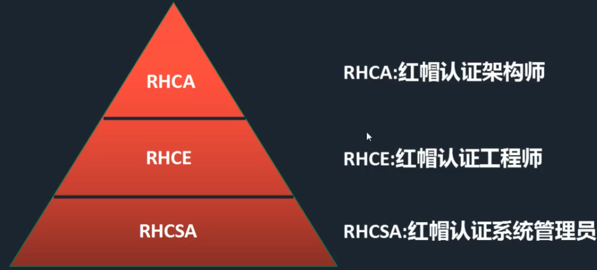

# Linux发行版和RHCE

## 一、RHEL

**Red Hat Enterprise Linux** 红帽Linux商业公司

专门提供企业级的linux开发和服务。是一款商业程序。

#### RHCE：红帽认证工程师

## 二、CentOS

**Community Enterprise Operating System** 社区企业操作系统

开源免费的商业软件。CentOS和RHEL比较接近。

## 三、Ubuntu

桌面应用为主的开源GNU/Linux操作系统。

## 四、Debian

Debian社区维护的一个Linux版本。