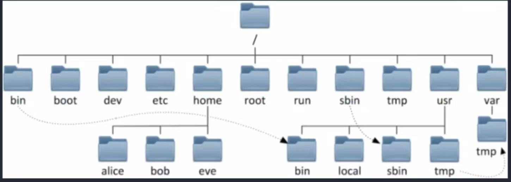

# 文件管理

## 一、linux文件划分 vs. windows文件划分

- Windows：多根的方式划分磁盘 `C:\` `D:\` `E:\`
- Linux：以单根的方式组织文件，所有的文件都放在根目录 `/`下面。

## 二、linux文件目录结构

  

## 三、常见的二级目录

- `/bin`：存放系统基本的用户命令（二进制文件），例如`ls`、`cp`等
- `/boot`：存放内核、初始 RAM 磁盘（initrd）和引导加载程序（如 GRUB）文件
- `/dev`：device，主要放驱动程序
- `/etc`：存放系统配置文件，如网络配置
- `/home`：用户主目录。每个用户都在这个路径下有一个子路径
- `/sbin`：存放系统管理命令，需要超级用户权限才能执行
- `/usr`：用户程序和数据目录
- `/var`：可变数据文件，如日志、缓存、邮件等
- `/run`：运行时数据存放目录，重启后会清空
- `/tmp`：所有用户和程序都可以使用的临时文件路径。系统重启之后会自动清空
- `/root`：超级用户的账户目录（类似`home/`下的子目录，但是属于root用户）

## 四、Linux文件和目录管理规范

### 4.1 常见文件类型
- `-`：普通文件（文本文件，二进制文件，音频文件）
- `d`：目录
- `b`：设备文件（块设备），存储设备硬盘，U盘。例如`/dev/sda/`
- `c`：设备文件（字符设备）打印机，终端，例如`/dev/tty`
- `l`：链接文件
- `s`：套接字文件
- `p`：管道文件

## 五、目录相关常见命令

- `cd`：change directory。改变路径。可以接绝对路径，例如`cd /`切换到根目录；也可以接相对目录。
- `pwd`：print working directory，打印当前目录
- `ls`：list，列出当前目录下的文件和子目录。参数可以指定要打印的目录。有下面选项——
    - `-l`: 详细列表。列表中：
      第一个字符：`-`表示这是一个文件;`d`表示这是一个路径。例如`ls -l /`命令是详细打印根目录下的所有文件和路径。
- `touch \dir1\dir2\file`：创建文件
- `mkdir`：创建路径。
    - `-p`：如果出现父路径不存在，则创建
- `cp src_file dst_dir`：拷贝命令

> Linux命令语法：
> 命令 + 选项 + 参数