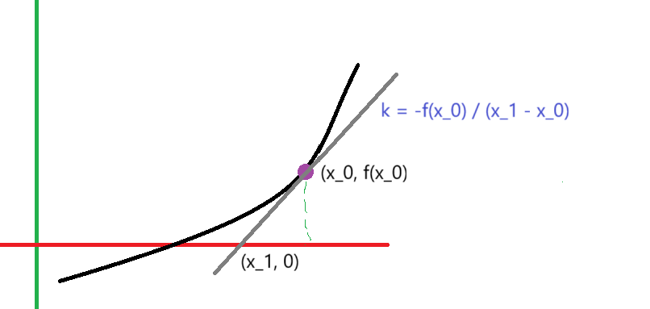

# Newton Method

> 这个方法是用来快速求解函数的零点。

## 问题

对于函数$y = f(x)$，为了快速求解根$x'$，满足$f(x') = 0$，我们进行如下的步骤：

- 第一步：随机取出一个点$x_0$，作为迭代初始点
- 第二步：开始迭代——
  * 计算点$(x_0, f(x_0))$处的斜率$k$，容易得到 $k = -\frac{f(x_0)}{x_1 - x_0}$，求该切线与$x$轴的交点：
  
    
    
    容易得到，$x_1 = x_0 - \frac{f(x)}{f'(x)}$
- 设置精确度：我们给定容忍度$\epsilon$，如果满足$\|f(x)| < \epsilon$，则迭代停止

## 注意！

Newton Method求解的是$f(x) - a = 0$的表达式的根.对于指定的函数表达式$y=f(x)$是不适用的。

## 示例

在讲解[快速倒数平方根](./../../CG/math/fast_inverse_square_root/doc/fast_inverse_square_root.md)一文，给出了一个使用Newton Method求解的样例

