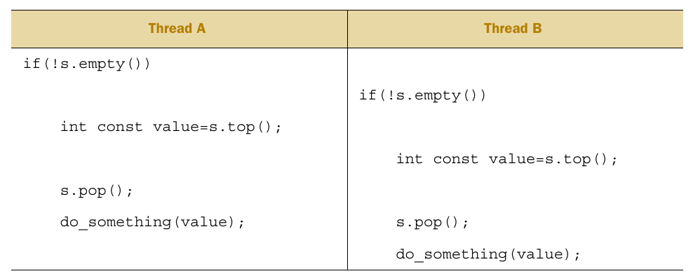

# 线程间数据共享

## 一、共享数据的问题

**所有共享数据的问题归根结底都是修改数据顺序导致的**。

**不变性(invariants)**  是保证多线程数据正确性的一个分析技巧。数据的不变性是指对于一个数据结构的特征描述始终不变。

### 1.1 Race conditions

并发编程中，竞争条件(Race conditions)是指运行结果依赖于执行顺序。

> race condition并不总是意味着问题。例如将数据加入一个容器，如果不关心顺序的话，按照什么顺序加入并不重要

会导致BUG的race condition经常在需要多步执行的单个操作之内。

### 1.2 避免条件竞争

- **数据保护**：将数据结构保护起来，并且提供一些访问的保护机制，**保证invariants破坏的情况处于保护之下，在其他线程的视角下invariants保持一致**。

- **重新设计数据结构和操作**：修改数据结构的设计和它的invariants，让修改行为由一系列不可见的改变构成，并且任何一步改变都能保持invariants。这种设计通常被成为**lock-free programming**。
- **使用transactions修改数据**。

## 二、使用mutex保护共享数据

mutex(*mu*tual *ex*clusion)是提供数据保护的一种同步原语。线程库保证当一个线程成功加锁一个mutex之后，其他企图给它上锁的线程会等待前面加锁的其他线程解锁。

### 2.1 使用mutex

- **创建**：构造一个`std::mutex`对象
- **上锁**：`std::mutex`对象的`lock()`成员函数
- **解锁**：`std::mutex`对象的`unlock()`成员函数

使用`std::lock_guard`对象来引入RAII语义。

### 2.2 设计合适的代码结构

即使使用`std::mutex`也并不意味着数据就被完美地保护起来了。例如，假设成员函数将内部数据的指针或者引用返回给外界，则将数据修改权完全暴露出去，成员函数使用`std::mutex`也会失效。这意味着我们仍然需要恰当地设计我们的代码。

即使我们不直接在成员函数的返回值将内部数据指针或者引用返回到外界，也会存在其他情况导致类似的结果：如果在成员函数内部调用通过参数传递进来的外部函数，然后将内部数据传递给该函数并且调用，则同样会导致数据的保护泄露。

因此，这里给出一条忠告：

**永远不要将受保护数据的指针或者引用传递到锁的范围之外。** 这些情形包括：
- 函数返回值返回 
- 将数据存储在外部可见的内存 
- 作为参数传递给外部函数

### 2.3 接口内生的竟态条件

即使我们使用`mutex`将每一个成员函数都保护起来了，也并不意味着race condition就消失了，接口本身的设计也会导致race condition。以`stack`为例：

```C++
stack<int> s;
if(!s.empty()){
    int const value=s.top();
    s.pop();
    do_something(value);
}
```
上面的每一个成员函数`empty()`、`top()`、`pop()`内部都使用`mutex`保护起来了，但是如果是下面这种执行顺序，则仍然会出现竞争条件：



- 栈顶的同一个元素被处理了两次，而另一个元素被弹出后没有被处理。

> **[?]** 为什么标准库设计的`stack`是采用`top`+`pop`这种方法来弹出栈顶元素？

如果我们设计的`stack`不是采用`top`+`pop`的方法返回栈顶元素，而是直接通过`pop`将数据返回，则会出现新的问题：

- 如果`pop`是先弹出栈顶元素然后返回，如果返回的元素被拷贝的时候由于内存不够（例如`stack<vector<int>>`）等原因导致拷贝失败，则会出现数据丢失：外界拷贝数据失败，但是栈中已经没有了该数据

下面是一些解决方法

- **用引用参数接受返回值** : 这样的话，现在外部构造好对象之后，再在内部将弹出的元素赋值给参数
    - 要求先构造对象
    - 要求对象类型支持被赋值
- **要求对象支持不会抛出异常的拷贝或者移动构造函数**
    - 使用`std::is_nothrow_copy_constructible`和`std::is_nothrow_move_constructible`来静态判断
- **返回一个指针** ：拷贝指针是绝对不会抛出异常的
    - 要求我们管理对象的内存
    - 简单类型例如`int`等，使用指针的性能比直接返回值低
    - 可以使用`std::shared_ptr`
