# CH07. 数据库设计和 E-R 模型

## 一、设计过程概览

### 1.1 设计阶段

1. **需求分析**：完整刻画未来数据库用户的数据需求
2. **概念设计**：选择数据模型，将需求转化为数据库的概念模式。本章的实体-联系模型通常用于表示概念设计
3. **功能需求规格说明**（specification of functional requirement）：描述将在数据上进行的各类操作（或事务）
4. **从抽象数据模型转换到数据库实现**：
   - **逻辑设计阶段**（logical-design phase）：将高层概念模式映射到实现数据模型（通常是关系数据模型）。包括将 E-R 概念模式映射到关系模式
   - **物理设计阶段**（physical-design phase）：指明数据库的物理特征，包括文件组织格式和索引结构的选择

### 1.2 设计选择

数据库设计中的一个主要部分是决定如何在设计中表示各种类型的"事物"。我们以**实体**（entity）来指示所有可明确识别的个体。

设计数据库时必须避免两个主要缺陷：

- **冗余**：信息冗余易导致更新遗漏——未将同一信息的多处同时更新，最终造成数据不一致。理想情况下，信息应只出现在一个地方。
- **不完整**：糟糕的设计可能导致新数据难以加入。例如仅维持一张选课关系表，每次选课都将课程信息加入该表；若出现新课程且尚未选课，则无法添加。

## 二、实体-联系模型

实体-联系（entity-relationship，E-R）数据模型采用三个基本概念：

- **实体集**
- **联系集**
- **属性**

E-R 模型还有一个相关联的图形表示（E-R 图）。

### 2.1 实体集

**实体**（entity）是现实世界中可区别于其他对象的一个对象。每个实体都有一组性质，其中一些性质的值能够唯一标识一个实体。

**实体集**（entity set）是相同类型（即具有相同性质或属性）的实体集合。实体集是一个抽象概念，例如"学生"实体集指代一所大学中所有学生。

我们用 **extension** 表示属于实体集的实体的实际集合。例如某大学实际学生的集合构成了"学生"实体集的一个 extension。

实体通过一组**属性**（attribute）来表示。

### 2.2 联系集

**联系**（relationship）是多个实体间的互相关联。

**联系集**（relationship set）是相同类型联系的集合。

实体集之间的关联称为**参与**（participate）。即实体集 E1, E2, ..., En 参与了联系集 R。

**联系实例**（relationship instance）表示所建模的现实世界中命名实体间的一个关联。例如 ID 为 12345 的 *student* 实体 Jack 和一个 ID 为 201801 的 *course* 实体参与到了 *take* 联系的一个联系实例中，表明 Jack 上了这门课。

实体在联系中扮演的功能称为实体的**角色**（role）。通常参与一个联系的实体集互异，此时角色是隐含的；但若同一实体集多次出现（称为**自环** / recursive 联系集），则必须显式地用不同角色名来指明。

联系也可以具有**描述性属性**（descriptive attribute），例如 *take* 联系中的时间属性。

> 给定联系集中的一个联系实例必须由其参与的实体唯一标识，而不必使用其描述性属性。

数据库系统中的大部分联系集是**二元**（binary）的（参与实体集个数为 2），但有时也会出现多于 2 个的情况。参与联系集的实体集数目称为联系集的**度**（degree）。

### 2.3 属性

每个属性都有一个可取值的集合，称为该属性的**域**（domain）。

E-R 模型中的属性可按如下类型划分：

| 类型 | 说明 |
|------|------|
| **简单**（simple）与**复合**（composite） | 简单属性不可再分；复合属性可划分为更小的部分（例如姓名可拆为姓和名） |
| **单值**（single-valued）与**多值**（multivalued） | 例如一个人可有多个电话号码，用花括号表示多值：`{phone_number}` |
| **派生**（derived） | 可从其他相关属性或实体派生（如 *age* 可从 *birthdate* 算出）。**派生属性的值不存储，需要时计算** |

若实体在某个属性上没有值，则使用**空值**（null）。空值可表达以下含义：

1. **不适用**：该实体不具备该值（如一个人可以没有中间名）
2. **未知/缺失**：该实体本应有值，但我们不知道（如某个人的名字为空）

## 三、约束

E-R 模式可定义数据库中的数据必须满足的约束。这里讨论映射基数和参与约束。

### 3.1 映射基数

**映射基数**（mapping cardinality）标识一个实体通过一个联系能关联到的实体个数，对于描述二元联系集非常有用。

对于实体集 A 和 B 之间的二元联系集 R，映射基数必为以下情况之一：

| 类型 | 说明 |
|------|------|
| **一对一** | A 中一个实体至多与 B 中一个实体相关联，反之亦然 |
| **一对多** | A 中一个实体可与 B 中任意数量实体相关联，但 B 中一个实体至多与 A 中一个实体相关联 |
| **多对一** | A 中一个实体至多与 B 中一个实体相关联，但 B 中一个实体可与 A 中任意数量实体相关联 |
| **多对多** | A 中一个实体可与 B 中任意数量实体相关联，反之亦然 |

### 3.2 参与约束

- **全部参与**（total participation）：实体集 E 中每个实体都参与到联系集 R 的至少一个联系中
- **部分参与**（partial participation）：实体集 E 中存在实体未参与到联系集 R 中

### 3.3 码

必须有一个区分给定实体集中实体的方法。概念上每个实体都不相同，但从数据库角度必须通过其属性来区分不同实体。因此，实体的属性值必须能唯一标识该实体。

码同样用于唯一标识联系，并将联系区分开来。

设 R 是涉及实体集 E1, E2, ..., En 的联系集，*primary(Ei)* 表示实体集 Ei 的主码属性集合。

- 若 R 无属性与之关联，则属性集合 `primary(E1) ∪ primary(E2) ∪ ... ∪ primary(En)` 描述了 R 的一个联系
- 若 R 有属性 a1, a2, ..., an 与之关联，则属性集合 `primary(E1) ∪ ... ∪ primary(En) ∪ a1 ∪ ... ∪ an` 描述了 R 的一个联系

在以上两种情况下，`primary(E1) ∪ primary(E2) ∪ ... ∪ primary(En)` 构成了联系集 R 的一个超码。

**联系集的主码结构依赖于映射基数**：

| 二元联系类型 | 主码构成 |
|-------------|---------|
| 多对多 | 两个实体集的主码共同构成 |
| 一对多 / 多对一 | "多"那一方实体集的主码单独构成 |
| 一对一 | 任意一方的主码均可构成 |

## 四、从实体集中删除冗余属性

使用 E-R 模型设计数据库的一般顺序：

1. 确定应包含哪些实体集
2. 为每个实体集挑选适当的属性
3. 确认实体集之间的联系

在第三步中，往往会发现实体集属性中的冗余属性。

一个经典模式：假设 E1 和 E2 之间具有联系 R，而 E1 的属性中包含 E2 的主码，则 E1 中存储的 E2 的主码就是冗余属性。

## 五、实体-联系图

### 5.1 基本结构

| 构件 | 含义 |
|------|------|
| 分成两部分的矩形 | 实体集：上半部分为名，下半部分为属性列表 |
| 菱形 | 联系集 |
| 未分割的矩形 | 联系集的属性（主码属性以下划线标明） |
| 线段 | 连接实体集到联系集 |
| 虚线 | 连接联系集属性到联系集 |
| 双线 | 表示全部参与（单线表示部分参与） |
| 双菱形 | 连接到弱实体集的标识性联系集 |

下图是一个典型的 E-R 图：

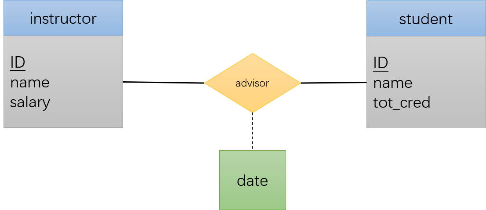

### 5.2 映射基数

在实体集与联系集的连线上加箭头表示映射基数：被箭头指着的一方是"一"，无箭头的是"多"。

例如下图是一个"一对多"关系：

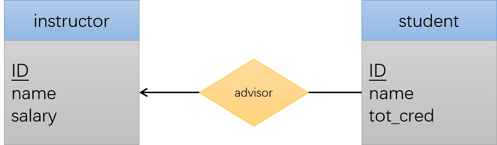

还可在连线上用 `l..h` 表示映射基数（`l` 为最小基数，`h` 为最大基数）：

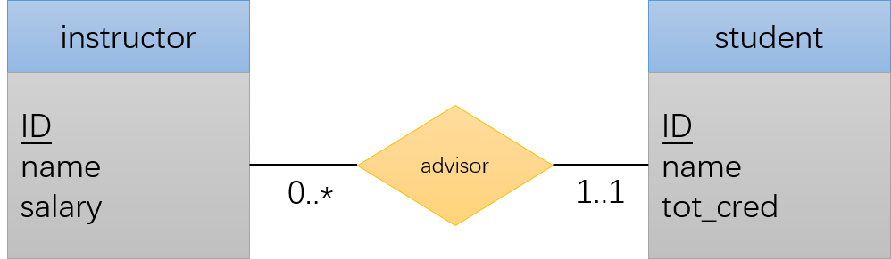

理解方法：

- 连着 *instructor* 的线上写 `0..*`：一个 instructor 可有 0 到任意个学生
- 连着 *student* 的线上写 `1..1`：一个 student 有且仅有 1 个导师

### 5.3 复杂属性

下图展示了 E-R 图中的复杂属性：

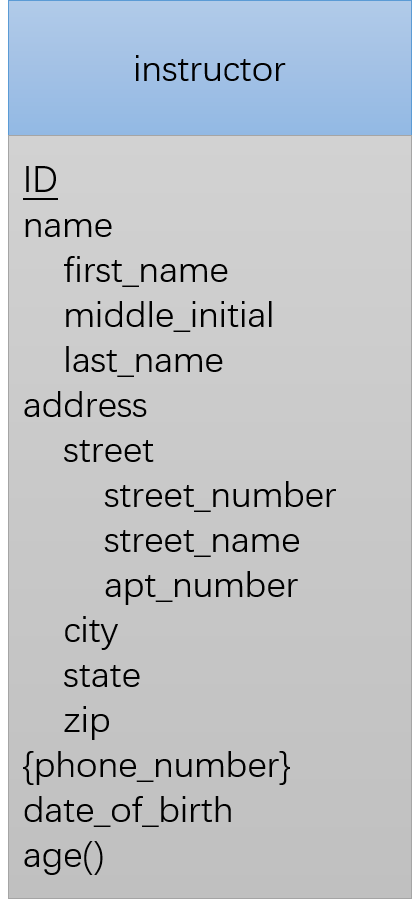

其中：

- 复合属性中的子属性缩进表示
- `{phone_number}` 表示多值属性
- `age()` 表示派生属性

### 5.4 角色

在 E-R 图中，通过在菱形与矩形之间的连线上标注来表示角色。

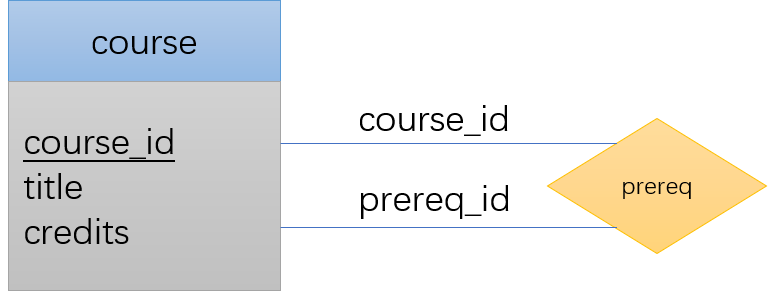

### 5.5 非二元的联系集

非二元的联系集也可用 E-R 图表示。

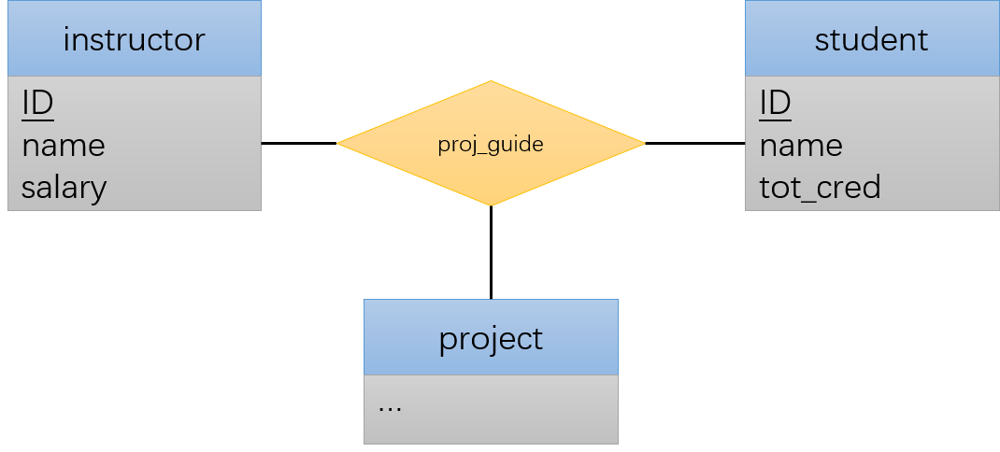

规定：**非二元联系集中至多允许一个箭头指向实体**。因为若箭头超过一个，会存在两种解释方法。

假设实体集 A1, A2, ..., An 之间有联系集 R，且指向 Ai+1, Ai+2, ..., An 的边是箭头，则存在以下两种解释：

1. 来自 A1, A2, ..., Ai 的实体的一个特定组合至多与一个来自 Ai+1, Ai+2, ..., An 的实体组合相关联，因此 R 的主码可用 A1, A2, ..., Ai 的主码并集构造
2. 对每个实体集 Ak（i < k ≤ n），每个集合 {A1, A2, ..., A(k-1), A(k+1), ..., An} 构成一个候选码

若只有一个箭头，以上两种解释等价。为避免混淆，仅允许一个箭头。

### 5.6 弱实体集

考虑 *section*（课程开课）实体：包含属性"课程编号""学期""学年""开课编号"，与 *course* 实体集具有关联，可用联系集 *sec_course* 连接。

加入 *sec_course* 后，*section* 中出现冗余属性——*sec_course* 已记录课程编号。但删除 *section* 中的课程编号后，剩余属性无法唯一标识一个 *section* 实体。

这种**没有足够属性以形成主码的实体集**称为**弱实体集**（weak entity set）。相应拥有主码的称为**强实体集**（strong entity set）。

| 概念 | 说明 |
|------|------|
| 弱实体集 | 必须与**标识实体集**（identifying / owner entity set）相关联才有意义 |
| 存在依赖 | 每个弱实体必须与一个标识实体关联，即弱实体集**存在依赖**于标识实体集 |
| 标识性联系 | 将弱实体集与其标识实体集相连的联系集，用双菱形表示 |
| 联系性质 | 标识性联系集是从弱实体集到标识实体集的**多对一**关系，弱实体集**全部参与**，且**不能有任何描述性属性** |

弱实体集中能够区分同一标识实体关联的多个弱实体的属性集称为**分辨符**（discriminator），也称**部分码**。例如对 *course* 而言，*section* 的"学期""学年""开课编号"可区分每次开课。

> **弱实体集的主码 = 分辨符 + 标识实体集的主码**

在 E-R 图中：

- 弱实体集的分辨符以下划线标明
- 关联弱实体集和标识性强实体集的联系集以双菱形表示

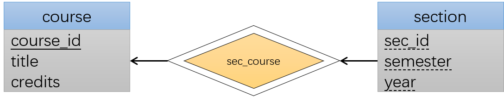

弱实体集也可作为属主实体集与另一个弱实体集参与标识性联系。弱实体集还可与多个标识实体集关联，此时主码为标识实体集主码的并集加上弱实体集的标识符。

> 有时可将弱实体集设计为标识实体集的一个**多值复合属性**，但建议仅在弱实体集只参与标识性联系且属性不多时使用。

## 六、转为关系模式

E-R 模型和关系数据库模型都是现实世界企业的逻辑表示，两种模型采用类似的设计原则，因此可将 E-R 设计转为关系设计。

### 6.1 具有简单属性的强实体集的表示

对于具有简单描述性属性 a1, a2, ..., an 的强实体集，用具有 n 个不同属性的模式 E 表示该实体集。该模式中每个元组对应实体集 E 中的一个实体。强实体集 E 的主码即为生成关系的主码。

### 6.2 具有复杂属性的强实体集的表示

| 属性类型 | 转换方式 |
|---------|---------|
| 复合属性 | 为每个子属性创建一个单独的属性 |
| 多值属性 | 创建新的关系模式，包含该多值属性以及对应实体集/联系集的主码属性。该模式的主码由所有属性组成。需构建外码约束（由实体集主码属性参照实体集生成的关系）。若实体集只包含主码和一个多值属性，可直接删除实体集生成的关系模式，仅保留多值属性创建的模式 |
| 派生属性 | 不在关系数据模型中显式表示 |

### 6.3 弱实体集的表示

设 A 是具有属性 a1, a2, ..., am 的弱实体集，B 是 A 依赖的强实体集（主码为 b1, b2, ..., bn）。用名为 A 的关系模式表示实体集 A，包含属性集合 `{a1, a2, ..., am} ∪ {b1, b2, ..., bn}`。

- 为 A 建立到 B 对应关系模式的外码约束
- 添加级联删除完整性约束：若 B 实体被删除，所有关联的 A 实体也需被删除

### 6.4 联系集的表示

设 R 是联系集，a1, a2, ..., am 是所有参与 R 的实体集主码的并集，R 具有描述性属性 b1, b2, ..., bn。用名为 R 的关系模式表示该联系集，属性为 `{a1, ..., am} ∪ {b1, ..., bn}`。

联系集主码的选择：

| 联系类型 | 主码构成 |
|---------|---------|
| 二元 + 多对多 | 参与实体集主码的并集 |
| 二元 + 一对一 | 任意一个实体集的主码 |
| 二元 + 多对一 | "多"那一方实体集的主码 |
| n 元 + 无箭头 | 所有参与实体集主码的并集 |
| n 元 + 一个箭头 | 不在箭头一侧的所有实体集主码的并集 |

另外，对每个实体集 Ei，需建立从 R 中 Ei 的主码属性到 Ei 对应关系模式主码的外码约束。

#### 6.4.1 模式的冗余

连接弱实体集和相应强实体集的联系集比较特殊：

- 必然是多对一的（弱实体集为"多"）
- 不存在描述性属性

弱实体集生成的关系模式已包含依赖实体集的主码，因此标识性联系集的属性是弱实体集属性的子集。**标识性联系集生成的关系模式是冗余的，不必为其生成关系模式**。

#### 6.4.2 模式的合并

对于实体集 A 和 B 及其二元联系集 AB，若满足以下两个条件：

- A 在联系中**全部参与**（E-R 图中连接 A 和联系集的是双线）
- A 到 B 的映射基数是**多对一**

则可将 AB 和 A 合并。例如 *course* 和 *department* 是多对一关系，可直接将 *department* 的主码并入 *course* 中，不必新建 *course_dept* 联系集。

一对一联系下，联系集的关系模式可与任意一个实体集的模式合并。

即使不是全部参与也可合并，只需将对应属性置为空即可。例如若 *course* 尚未分配 *department*，则将对应的 *department* 主码属性置为空。

合并后需将原本联系集上的外码约束移动到合并的实体集中。

## 七、实体-联系设计问题

### 7.1 用实体集还是用属性？

什么构成属性、什么构成实体集并没有固定的判断方法，需根据实际情况决定。

通常易犯的错误是将相关实体集的主码属性作为联系集的属性。注意：**联系集已隐含了这种主码属性**（联系集创建的关系模式中会有相关实体集的属性，但 E-R 模式的联系集中不应出现）。

### 7.2 用实体集还是用联系集？

判断原则：**当描述发生在实体间的行为时采用联系集**。

### 7.3 二元还是 n 元联系集？

**一个 n 元联系集（n > 2）总能用一组不同的二元联系集替代**。

以一个抽象的三元联系集 R 为例（连接实体集 A、B、C）：

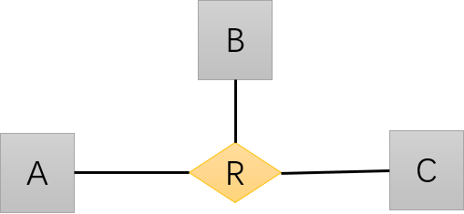

可创建一个新实体集 E 代替 R：

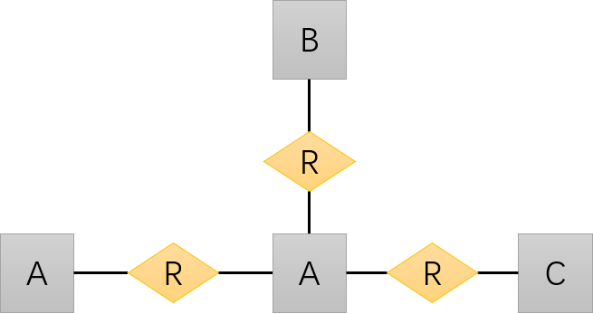

为此需要：

- 将原本 R 的描述性属性加入 E
- 给 E 添加一个特殊的标识属性（id），因为原本 R 的主码被分散到了三个新的联系集中

### 7.4 联系属性的布局

联系的映射基数会影响属性的布局：

- **一对一**：联系集的属性可放在相关实体集中的任意一个
- **一对多**：联系集的属性只能放在"多"那一方的实体集
- **多对多**：联系集的属性必须放在联系集本身

例如假设 *advisor* 是一对多联系集（一个导师指导多个学生，每个学生只有一个导师），表示指导开始时间的 *date* 属性可放在 *advisor* 中，也可放在 *student* 中。

## 八、扩展的 E-R 特性

### 8.1 特化

实体集可能包含一些子集，这些子集中的实体具有不被该实体集所有实体共享的属性。

例如 *person* 可进一步归类为 *employee* 和 *student*。每个子实体集的属性集都是 *person* 的属性集加上各自独特的附加属性。

这种在实体集内部进行分组的过程称为**特化**（specialization）。

在 E-R 图中，特化用特化实体指向另一方实体的空心箭头表示，这种关系称为 ISA 关系（"is a"）。

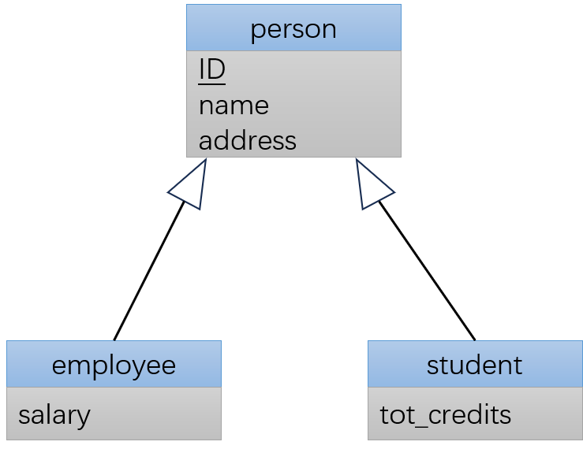

| 特化类型 | 说明 |
|---------|------|
| **重叠特化**（overlapping） | 一个实体可属于多个特化实体集 |
| **不相交特化**（disjoint） | 一个实体至多属于一个特化实体集 |

### 8.2 概化

特化是自顶向下的设计过程；反过来自底向上的过程称为**概化**（generalization）。

### 8.3 属性继承

特化/概化构成继承关系，引入**属性继承**（attribute inheritance）：高层实体的属性被低层实体集继承。**低层实体集同时继承地参与了高层实体集所参与的联系集**。

### 8.4 概化上的约束

**成员资格确定方式**：

| 方式 | 说明 |
|------|------|
| **条件定义**（condition-defined） | 成员资格取决于实体是否满足显式条件或谓词 |
| **用户指定**（user-defined） | 用户直接指定实体所属的低层实体集 |

**成员归属约束**：

| 约束 | 说明 |
|------|------|
| **不相交**（disjoint） | 一个实体至多属于一个低层实体集 |
| **重叠**（overlapping） | 一个实体可同时属于多个低层实体集 |

**完全性约束**（completeness constraint）：描述高层实体集的实体是否必须属于某个低层实体集。

| 类型 | 说明 |
|------|------|
| **全部概化/特化**（total） | 每个高层实体必须属于一个低层实体集 |
| **部分概化/特化**（partial） | 允许高层实体不属于任何低层实体集（默认） |

要在 E-R 图中表示全部概化，可添加关键词 "total" 并引出一条虚线连接到对应的继承线；或让虚线指向所有继承线三角箭头集中的地方。

### 8.5 聚集

**聚集**（aggregation）的作用是将一个联系视为一个高层实体。

对于下面这个三元联系：

假设现在需要给每次指导添加一个评估报告，将评估建模为主码为 *evaluation_id* 的实体 *evaluation*。直接的方法是在 *evaluation*、*instructor*、*project*、*student* 之间建立四元联系：

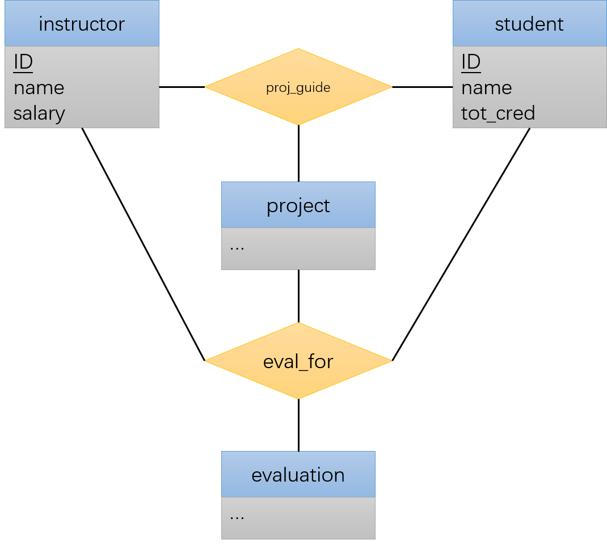

但这种方式容易产生信息冗余：*eval_for* 的每个 *instructor*、*student*、*project* 组合肯定也在 *proj_guide* 中。

若 *eval_for* 只是一个简单的值，可直接放入 *proj_guide*。但如果 *evaluation* 与其他实体关联，则此法行不通。

面对这种情况，可使用聚集：

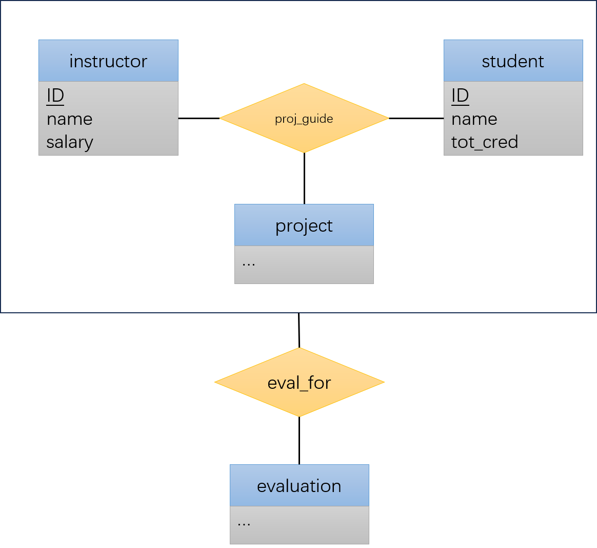

通过聚集，将 *proj_guide* 视为一个名为 *proj_guide* 的高级实体集。

### 8.6 转为关系模式

#### 8.6.1 概化

有两种方法：

**方法一**：为高层实体集创建一个模式，为每个低层实体集创建一个模式。低层实体集的属性包括自身属性加上高层实体集的主码。

生成的关系模式：

- `person(ID, name, street, city)`
- `employee(ID, salary)`
- `student(ID, tot_cred)`

需在低层实体集上建立外码约束：低层实体集模式的主码需参照高层实体集模式的主码。

**方法二**：若概化是 **不相交** 且 **完全** 的（任何高层实体也恰好是某个低层实体集的成员），则可不给高层实体集创建模式，只给每个低层实体集创建模式。每个低层实体集的属性包括自身属性加上高层实体集的所有属性：

- `employee(ID, name, street, city, salary)`
- `student(ID, name, street, city, tot_cred)`

这种方法在建立外码约束时会有困难：若某个关系 R 需引用 *person* 的主码，则无法通过引用一个模式完成。

#### 8.6.2 聚集

将聚集转为关系模式很直接：以 8.5 节的例子，在联系集 *eval_for* 得到的模式中包含 *proj_guide* 中的所有主码以及实体集 *evaluation* 中的所有主码即可。
