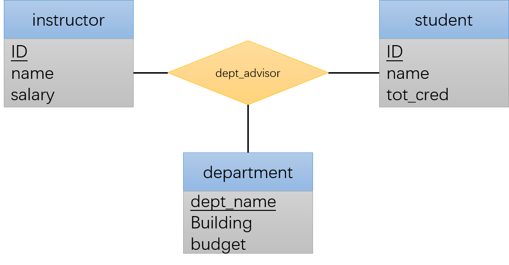

# CH08. 关系数据库设计

## 一、好的关系设计的特点

我们以下面的两个关系来探讨：

- <i>instructor(<u>ID</u>, name, dept_name, salary)</i>
- <i>department(<u>dept_name</u>, building, budget)</i>

### 1.1 更大的模式

假设我们用下面的模式替换上面的两个模式：

<i>inst_dept(<u>ID</u>, name, salary, dept_name, building, budget)</i>

这样做似乎是一个好主意：我们能够在查询的时候避免不必要的连接。

然而，当我们真的插入了大量数据之后，我们会发现一个问题：我们对同一个系里的老师不得不重复存储*(dept_name, building, budget)*信息。另外，为了让所有老师的记录里面的*budget*信息一样，可能插入的时候还得小心一点。

即使我们容许数据重复，这个模式还有一个其他问题：我们无法记录一个目前还没有老师的新系。

### 1.2 更小的模式

现在假定我们初始的设计就是*inst_dept*，我们将面临这样一个问题：我们如何能发现这个模式出现了信息重复？并且我们如何判断出我们应该将它分成*instructor*和*department*两个模式？

经过观察，我们会发现存在这样一个要求：每个系必须只有一个办公楼和预算值。换句话说：我们需要一条这样的规则“如果存在模式*（dept_name, budget)*，则*dept_name*可以作为主码”。这条规则被定义为**函数依赖**(functional dependency):

<center><i>dept_name</i>-><i>budget</i></center>

给定这条规则，我们就能知道*inst_dept*关系的问题了：由于同一个系下面会有很多老师，因此*inst_dept*下面会出现重复的*dept_name*，因此*dept_name*不能成为*inst_dept*的主码。

然而，并不是所有的分解都是有益的。假设我们将下面的模式

<center></i>employee(<u>ID</u>, name, street, city, salar有)</i></center>

分解为下面两个模式：

<center></i>employee1(<u>ID</u>, name)</i></center>
<center></i>employee1(<u>name</u>, street, city, salar)</i></center>

这种分解显然是有害的：假设存在同名的雇员住在不同的地区：

<center>(57766, Kim, Main, Perryridghe, 75000)</center>
<center>(98776, Kim, North, Hampton, 67000)</center>
我们分解之后会得到：

<center>(57766, Kim)</center>
<center>(98776, Kim)</center>
<center>(Kim, Main, Perryridghe, 75000)</center>
<center>(Kim, North, Hampton, 67000)</center>

我们会发现我们无法再通过自然连接获取到原始元组了。虽然新的分解之下通过自然连接我们获取了更多的元组，但其实其中包含的信息更少。

我们称这种分解为**有损分解**（lossy decomposition）；反之则称为**无损分解**（lossless decomposition）。

## 二、原子域和第一范式

E-R模型支持实体集和联系集的属性具有某种程度的子结构。比如说多值属性和复合属性。当从包含这些类型的ER设计创建表的时候，我们需要消除这种子结构：

- 对于组合属性：让每个子属性本身称为一个属性
- 对于多值属性：未多值集合中的每个项创建一条元组

形式化地，一个域是**原子**（atomic）的，如果该域的元素被认为是不可分的单元。

如果一个关系模式R的所有属性的域都是原子的，则称R属于**第一范式**（First Normal Form）。

## 三、使用函数依赖进行分解

我们先定义如下符号描述：

- 希腊字母（例如α）标识属性集
- r(R)标识该模式是关系r，R是属性集
- K表示是超码的属性集

### 3.1 码和函数依赖

现实生活中，数据上往往存在各种约束，例如：

- 每个学生和教师只有一个名字
- 每个学生只属于一个系

等等。一个关系中满足所有这种现实世界中约束的实例，我们称是一个关系的**合法实例**（legal instance）。

几种现实生活中常见的约束可以形式化地表达为码（超码，候选码以及主码）或者函数依赖。

我们这样定义**函数依赖**：

给定r(R)的一个实例，这个实例**满足函数依赖**α->β的条件是： 对实例中所有的元组对t1和t2，若t1[α]=t2[α]，则t1[β]=t2[β]。

如果r(R)的每个合法实例都满足函数依赖α->β，则我们说该函数依赖在模式r(R)上**成立**（hold）。

因此，根据函数依赖定义，我们可以很容易定义**超码**：如果函数依赖K->R在r(R)上成立，则K是r(R)的超码。

有一些函数依赖是对于所有元组都无条件成立的。例如A->A在所有包含属性A的关系上都是满足的；同样，AB->A也在所有包含属性A的关系上是成立的。我们称呼这种函数依赖是**平凡**（trivial）的。更一般的，如果β⊆α，则α->β是平凡的。

给定关系r(R)上满足的函数依赖集合F，我们可以根据F推导出其他函数依赖，例如如果A->B，B->C在F内，则很显然A->C函数依赖也是成立的。我们用F+来表示F集合的**闭包**（closure），表达的是能够从函数依赖集F推导出的所有函数依赖构成的集合。

### 3.2 Boyce-Codd范式

**Boyce-Codd**范式(Boyce-Codd Normal Form, **BCNF**)是这么定义的：

具有函数依赖集F的关系模式R满足，对于F+中所有形如α->β的函数依赖，下面至少一项成立：

- α->β是平凡的函数依赖，即β⊆α
- α是模式R的一个超码

前面提出的例子是一个不满足BCNF范式的关系：*inst_dept(ID, name, salary, dept_name, building, budget)*。因为存在函数依赖*dept_name*->*budget*，既不是平凡的，*dept_name*也不是关系的超码（因为同一个系下面会出现很多老师，因此同一个*dept_name*会出现多次。

下面是将不满足BCNF范式的分解为满足BCNF范式的一般规则：

设R是不属于BCNF的一个模式，则存在至少一个非平凡的函数依赖α->β，其中α不是R的超码。我们使用下面两个模式取代R：

1. (α ∪ β)
2. (R - (β - α))

以上面的*inst_dept*为例，α=*dept_name*，β=*(building, budget)*。则我们得到了两个新的模式：

1. (α ∪ β) = *(dept_name, building, budget)*
2. (R - (β - α)) = *(ID, name, salary, dept_name)*

### 3.3 BCNF范式与保持依赖

BCNF分解有时候会破坏函数依赖。这里举一个例子:

在*student*、*department*和*instructor*之间有这样的关系：

1. 一个学生可以有多个导师
2. 但是在一个系中一个学生只能有一个导师
3. 一个导师只能在一个系

下面是E-R图:



我们得到联系集*dept_advisor(s_ID, i_ID, dept_name)*。

根据前面的约束，我们可以得到下面的函数依赖：

- i_ID->dept_name : 一个教授只能在一个系
- s_ID,dept_name->i_ID : 给定一个学生和一个系，只能有一个导师

我们可以看到，第二个函数依赖是符合BCNF范式的，因为这个约束下，*(s_ID, dept_name)*构成一个超码。但是第一个函数依赖不符合BCNF范式，因此*i_ID*不是超码，这个函数依赖也不是平凡的。

按照BCNF范式的分解操作，我们可以得到下面两个新的关系模式：

1. *(i_ID, dept_name)*
2. *(s_ID, i_ID)*

这两个模式都符合BCNF范式。然而，我们发现一个问题：经过拆分之后，函数约束s_ID,dept_name->i_ID消失了!

这种函数约束的消失需要我们使用触发器等对象来额外确认。

### 3.4 第二范式

**部分依赖**（partial dependency）：对于函数依赖α->β，如果存在α的真子集γ使得γ->β。

**第二范式**（Second Normal Form，2NF）是这么定义的：关系R如果满足下面两个条件之一，则R属于第二范式：

- 它出现在一个候选码中
- 它没有部分依赖于一个候选码

### 3.5 第三范式

由于BCNF范式要求太高了，因此这里介绍**第三范式**：

具有函数依赖集F的关系模式R属于**第三范式**的条件是：

对于F+中所有形如α->β的函数依赖，以下至少一项成立：

- α->β是一个平凡的函数依赖
- α是R的一个超码
- β-α中的每个属性A都包含于R的一个候选码中

> 第三条中β-α中的不同属性可以包含于不同的候选码

#### 3.4.1 传递依赖

**传递依赖**是这样定义的：令α和β为属性集，使得α->β成立但是β->α不成立；令A为一个不属于α和β的属性，并且满足β->A.则称A传递依赖（transitively dependent）于α。

我们利用传递依赖可以重新定义3NF：具有函数依赖集F的关系模式R如果满足以下条件则属于3NF：没有非主属性A传递依赖于R的候选码。

> **主属性**：至少在一个候选码中出现的属性

我们可以证明使用传递依赖定义的3NF和前面的定义是一致的：对于第3条，如果α不是R的候选码，则α一定直接或者传递依赖于R的候选码（这是由候选码的性质决定的）；假设β-α中存在一个属性A不包含于R的任何一个候选码中，则这个非主属性A通过α传递依赖于R的候选码；因此反过来，如果β-α中的所有属性都属于某个候选码，则不存在一个非主属性传递依赖与R的候选码。

我们再来看之前的两个依赖：

- *i_ID*->*dept_name*
- *s_ID*,*dept_name*->*i_ID*

根据BCNF范式，我们应该根据第一个依赖进行分解；但是第一个依赖现在是满足3NF的。

### 3.6 更高的范式

有时候即使借用了函数依赖来对模式分解，也可能无法避免重复。

假设有这样一个例子：某个人记录了一组孩子名字和一组电话号码，这两个属性都是多值的。根据ER转为关系模式的方法，我们可以得到这样两个模式：

- (*ID*, *child_name*)
- (*ID*, *phone_number*)

如果我们将它们合并称为 (*ID*, *child_name*, *phone_number*)，我们会发现：新的关系满足BCNF范式，因为整个模式只有一个函数依赖*ID*, *child_name*, *phone_number*->*ID*, *child_name*, *phone_number*。

但是这种合并后的关系显然是有问题。假设某个人有两个孩子David和William，两个电话号码512-555-1234，512-555-4321，那么我们需要记录下面四个记录：

(9999, David, 512-555-1234)
(9999, David, 512-555-4321)
(9999, William, 512-555-1234)
(9999, William, 512-555-4321)

电话号码和孩子名字都不可避免的重复。

## 四、函数依赖理论

### 4.1 函数依赖集的闭包

给定关系集R，如果R的每个满足F的实例也满足*f*，则F**逻辑蕴含**（logically imply）*f*。

令F为一个函数依赖集，F的**闭包**是被F逻辑蕴含的所有函数依赖的集合，记作F+。

**Armstrong公理**（Armstrong's axiom）给出了一组规则来帮我们找到指定F的F+：

- **自反律**（reflexivity rule）：若α是一个属性集并且β⊆α，则α->β成立。
- **增补律**（augmentation rule）：若α->β成立且γ为一属性集，则γα->γβ成立。
- **传递律**（transitivity rule）：若α->β成立并且β->γ成立，则α->γ成立。

Armstrong公理实际应用不太方便，因此我们使用下面这些规则：

- **合并律**（union rule）：若α->β成立和α->γ成立，则α->βγ成立
- **分解律**（decomposition rule）：若α->βγ成立，则α->β和α->γ成立
- **伪传递律**（pseudotransitivity rule）：若α->β和γβ->σ成立，则αγ->σ成立

使用Armstrong规则计算F+的算法如下：

```c
F+ = F;
REPEAT
    FOR EACH f IN F+:
        在f上使用自反律和增补律，将结果添加到F+中
    FOR EACH (f1,f2) IN F+:
        IF f1和f2使用传递律结合起来，则将结果加入到F+中

UNTIL F+不发生变化
```

下面给出一个例子：

假设有属性集(A, B, C, G, H, I)及函数依赖集{A->B, A->C, CG->H, CG->I, B->H}，我们可以推导得到下面的几个依赖：

- A->H：传递律
- CG->HI；合并率
- AG->I：由A->C和CG->I，使用伪传递律得到AG->I。或者先使用增补率得到AG->CG，在结合CG->I使用传递律得到AG->I

### 4.2 属性集的闭包

如果α->β，我们称β被α**函数确定**（functionally determine）。

我们如何判断α是不是超码？一种方法是找到F+，然后将所有左侧是α的函数依赖的右侧合并起来，看看右边的属性集合是不是全集。

令α为一个属性集，我们将函数依赖集F下被α函数确定的所有属性集合称为F下α的闭包，记为α+。

计算α+的算法：

```
result := α
REPEAT
    FOR EACH 函数依赖β->γ IN F:
        IF β ⊆ result:
            result += γ
UNTIL result 不变
```

我们继续以上一节属性集和函数依赖集为例，计算(AG)+：
- 初始状态下是AG
- 因为A->B，而A⊆AG，因此添加B，为ABG
- 因为A->C，而A⊆AG，因此添加C，为ABCG
- 因为CG⊆ABCG，CG->H和CG->I，因此添加H和I，得到ABCGHI

**这个算法能找到α+的全部属性**。这个算法的时间复杂度是集合规模的二次方。

α+有多种用途:

- 判断α是不是超码
- 检查是否β⊆α+，我们可以检查α->β是否成立
- 使用这个算法我们可以找到F+：对于任意一个属性γ⊆R，我们找到闭包γ+；然后对于任意的S⊆γ+，我们输出一个依赖γ->S


### 4.3 正则覆盖

如果关系模式上有一个函数依赖集F，则每次更新该关系，数据库必须保证此更新不会破坏任何函数依赖。否则，系统必须回滚该更新操作。

我们可以通过测试于给定函数依赖集具有相同闭包的简化集的方式来减小检测开销。因为简化集和原集含有相同的闭包，所以满足简化集也一定满足原集。

如果去除一个函数依赖中的一个属性不改变该函数依赖集的闭包，则称该属性是**无关的**（extraneous）。更一般的，**无关属性**（extraneous attribute）的定义如下：

考虑函数依赖集F和F中的一个函数依赖α->β:

- 如果A∈α并且F逻辑蕴含(F-{α-β}) ∪ {(α - A)->B}，则属性A在α中是无关的
- 如果A∈β并且函数依赖集(F-{α-β}) ∪ {α-(β-A)}逻辑蕴含F，则属性A在β中是无关的

> 假设A∈α且A∈β，则从第二条出发，很容易证明A是无关的

我们来举例子说明：

**例子1**

假设存在函数依赖集 {AB->C, A->C}，这里的B在AB就是无关的。因为将AB-C删除，剩下的关系集{A->C}逻辑蕴含去掉B之后的AB->C——即A->C。
简单来说，条件一想要描述的是，**函数依赖中，如果删除左侧的某些变量之后，并不影响剩下变量之间的依赖关系（也就是说，即使将原本的依赖删掉，通过其他依赖推导出来），则这些变量就是多余的**。举例来说，如果我们已经存在依赖{身份证->年龄}依赖的话，在左侧添加其他属性就是多余的，比如说{身份证, 姓名->年龄}中，姓名就是多余的。

**例子2**
假设存在函数依赖集{AB->CD, A->C}，那么C在AB->CD中就是多余的。因为去掉C之后，剩下的函数依赖集{AB->D, A->C}能够退出原本的F：
因为A∈AB，所以AB->A(自反律)；因为A->C，所以AB->C(传递律)；因为AB->D、AB->C，因此AB->CD(合并律)。
条件二想要描述的是：**函数依赖集中，如果去掉右边一个变量之后，剩下的依赖能完整地推导出整个F，则这个变量就是多余的**。

令R为一个关系模式，且F是R上的一个函数依赖集。考虑F中的某一个函数依赖α->β涉及的属性A，我们应该怎么检验A是否有关呢？——

- 如果A∈β，则判断新的集合
    <center>F' = (F - {α->β}) ∪ {α->(β-A)}</center>
    是否可以推导出α->A。为此，我们可以额计算出F'下α的闭包α+，如果α+包含A，则说明A是无关的

- 如果A∈α，令γ=α-A，判断F能不能推导出γ->β。为此，我们计算γ在F下的闭包γ+，如果γ+包含β中的所有属性，则说明可以，则A是多余的

函数依赖集F的**正则覆盖**（canonical cover）F'是一个依赖集，满足F逻辑蕴含F'的所有依赖，F'逻辑蕴含F的所有依赖，并且满足：

1. F'中的所有函数依赖都不含无效变量
2. F'中所有函数依赖的左侧都是唯一的。即不存在α1->β1，α2->β2，α1=α2

函数依赖集F的正则覆盖可以使用下面的算法计算：

```
F' = F
REPEAT
    使用合并律将F'中所有的形如α1->β1，α1->β2的依赖替换成α1->β1β2
    在F'中寻找一个函数依赖α->β，它在α或者β中含有无关属性；如果找到一个无关属性，则将它从α->β中删除
UNTIL
```

下面以一个例子来讲解：假设模式(A,B,C)中含有函数依赖集F={A->BC, B->C, A->B, AB-C}，计算F的正则覆盖。

首先我们应该合并：将A->BC和A->B合并为A->BC，则依赖集更新为{A->BC, B->C, AB->C}

然后我们来检查多余属性：
    1.A->BC：有可能B和C是多于属性。我们均要判断一下。判断方法是F' = (F - {α->β}) ∪ {α->(β-X)}下，A的闭包A+是否包含X，我们用B和C分别替代X。经过判断，可以知道C是多余属性，更新集合为{A->B, B->C, AB->C}
    2.AB->C：有可能A和B是多余属性。我们均要判断一下。判断方法是目前的集合是否可以推导出(AB-X)->C，我们分别用A、B带入X。经过判断我们发现A和B都是多余的。**但是！！计算正则覆盖的时候遇见这种情况，只能删除一个，不能全部删除**。 
        假设我们删除A，则剩余集合为{A->B, B->C}
        假设我们删除B，则剩余集合为{A->B, B->C, A->C}；再进行合并后得到{A->BC, B->C}；判断得到C在A->BC中是无关的，因此最终结果为{A->B, B->C}

最终剩余集合{A->B, B->C}。因此最终的正则覆盖就是这个集合。

要知道的是：**一个函数依赖集的正则覆盖不是唯一的**。

### 4.4 无损分解

**无损分解**：如果将关系R分解为R1和R2，经过自然链接R1⋈R2能够得到R，则称这种分解是无损的。

使用函数依赖判断一个二元分解是否是无损的方法为，以下至少有一个函数依赖属于F+：

- R1∩R2->R1
- R1∩R2->R2

换句话说：**当两个分解之后的子关系属性的交集为至少一个子关系的主码的时候，这个分解就是无损的**。

### 4.5 保持依赖

我们利用函数依赖来重新定义什么是保持依赖：

对于关系模式R和R上的一个函数依赖集，R1，R2，R3……Rn是R的一个分解。我们定义F在Ri上的**限定**（restriction）为：

F+中只包含Ri中属性的函数依赖集合。

对于一个分解来说，我们考虑对应每个分解的限定F1，F2，F3……Fn，是否它们的并集F' = {F1 ∪ F2 ∪ F3 ∪ ... ∪ Fn}满足F'+ = F+，即F'的闭包和F的闭包是否相等。如果相等的话，则说明通过判断F'是否满足就能得到F是否满足，也即划分之后并没有函数依赖丢失了。

我们称满足F'+=F+的分解为**保持依赖的分解**（dependency-preserving decomposition）。

一种朴素的验证某个分解是否是保持依赖的方法是先计算出F+，然后获取每个分解的限定Fi，最后将每个限定Fi求并得到F'，再计算F'+，最后判断F+是否和F'+相等。这种算法需要计算F+，开销较大。

我们介绍两种相对来说开销较小的检查方法：

1. 第一种方法也很朴素：我们拿出F中每一个依赖，然后在每一个分解子关系Ri中验证其是否成立；如果F中每个依赖都能在某个Ri中被验证，则分解之后F是完全满足的。
    这种方法的问题是并不是F中每一个依赖都能找到某个Ri验证成功的；但是某个依赖没找到Ri验证成功并不一定意味着这个分解破坏依赖了。**这种方法知识一个充分条件，不是必要条件**。

2. 第二种方法稍微复杂。它对于F中的每一个形如α->β的依赖，执行下面的过程：
    ```
    result = α
    REPEAT
        FOR EACH Ri:
            t = (result ∩ Ri)+ ∩ Ri
            result = result ∪ t
    UNTIL result没有变化
    ```
    其中出现的属性闭包`(result ∩ Ri)`是在F下的。
    如果result包含β中所有属性，则函数依赖α->β在这个分解中保持了。如果每一个α->β都保持了，则我们说这个分解保持了所有依赖。

    这个算法主要依据下面两个思想：
    - 要验证α->β是否成立，需要验证α在F'中的闭包是否包含β。如果我们验证了每一个α->β都在F'成立，则验证了F的成立，这需要我们验证在每一个Ri上能够得到的α+，并集包含β
    - 对于任意α，很容易证明α->α+是F+中的一个函数依赖。α∩Ri⊆α，因此有α->(α∩Ri)+，因此(α∩Ri)+∩Ri的结果是在Ri中找到了α+的部分子集。通过这种方式遍历每一个Ri，找到所有Ri能够得到的子集，最终取并集得到α'，如果α'包含β的所有属性，则证明所有这些Ri共同证明了α->β成立。

## 五、分解算法

### 5.1 BCNF分解

#### 5.1.1 BCNF的判定方法

- 为了检查单个函数依赖α->β是否违反了BCNF，计算α+，并且验证它是否包含了R的所有属性（即验证α是否是R的超码）
- 为了检查关系模式R是否属于BCNF，则只需要检查F中的每一个关系模式都没有违反BCNF。我们如果验证了F中没有函数违反BCNF，则F+中也不会有函数依赖违反BCNF

**虽然我们可以在原集R上用F来判断是否违反了BCNF，但是分解之后，仅仅靠F中的函数依赖，我们无法判断分解的子集是否满足**。例如对于关系R(A,B,C,D,E)存在函数依赖集F={A->B, BC->D}；因为存在违反BCNF的依赖，所以我们将原集分解为R1={A,B}, R2={B,C,D,E}。R1显然是满足BCNF的（任何二元集合都满足BCNF）；但是R2呢？企图单纯通过F是无法判断的，因为F中的每一个依赖都不会仅仅涉及R2的属性。事实上R2是违反BCNF的，因为F+中包含一个AC->D（由原本的两个依赖通过伪传递律可以得到），这是一个R2上的函数依赖，违反了BCNF。

我们可以用如下的方法来判断分解之后的子关系是否违反BCNF：

- 对于Ri中的每个属性子集α，确保α+在F上的属性闭包要么不包含Ri-α的任何属性，要么包含Ri所有属性

我们可以很容易证明：如果Ri上有某个属性子集α违反了该条件，下面这个函数依赖一定在F+中：
<center>α->{(α+-α)∩Ri}</center>

因此，如果{(α+-α)∩Ri}不含了Ri的部分属性，说明按照函数依赖集F，α不是Ri的超码，因此Ri违反BCNF。

#### 5.1.2 BCNF分解算法

我们可以使用下面这个算法来分解关系，使其分解为一组符合BCNF模式的子集：

```
result := {R}
done := false
计算F+
WHILE NOT DONE DO
    IF result中存在模式Ri不属于BCNF THEN
        令α->β为一个在Ri上成立的非平凡函数依赖，满足α->Ri不属于F+，并且α∩β=∅;
        result := (result - Ri) ∪ (Ri-β) ∪ (α, β)
    ELSE
        done := true
```
这个算法在选取进行判别的非平凡函数依赖的时候，提到了两个要求：

- α->Ri不属于F+：这句话的意思是无法通过F+推导出α->Ri，否则α就是Ri的超码了，不能作为分解的依赖
- α∩β=∅：这是为了保证无损分解。如果不满足的话，则Ri-β中将不会包含α∩β的子集，也就无法完整保存α的所有属性，继而无法通过自然链接(Ri-β)和(α, β)还原Ri

我们在这里给出一个分解的例子。假设我们有下面的关系模式：

<center>class(course_id, title, dept_name, credits, sec_id, semester, year, building, room_number, capacity, time_slot_id)</center>
并且有下面的函数依赖集：
<div style="text-align: center;">
  <div style="display: inline-block; text-align: left;">
    1.course_id->title, dept_name, credits<br>
    2.building,room_number->capacity<br>
    3.course_id,sec_id,semester,year ->building, room_number, time_slot_id
  </div>
</div>

可以看到依赖3下，{course_id,sec_id,semester,year}是一个候选码。

函数依赖1中，course_id不是一个后超码，因此我们需要根据它来进行分解，得到：
<div style="text-align: center;">
  <div style="display: inline-block; text-align: left;">
    R1.(course_id,title, dept_name, credits)<br>
    R2.(course_id, sec_id,semester, year, building, room_number, capacity, time_slot_id)
  </div>
</div>

函数依赖building,room_number->capacity在R2上不是超码，因此根据这个进行分解得到：
<div style="text-align: center;">
  <div style="display: inline-block; text-align: left;">
    R1.(course_id,title, dept_name, credits)<br>
    R2.(course_id, sec_id,semester, year, building, room_number, time_slot_id)<br>
    R3.(building, room_number, capacity)
  </div>
</div>

    

### 5.2 3NF分解

下面是完成3NF分解的算法：

```
令F'是F的正则覆盖
i := 0
FOR EACH F'中的函数依赖α->β //注意这里是F'的每个函数依赖
    i:=i+1
    Ri := αβ
IF 模式Rj, j∈[1,i], 都不包含候选码
THEN
    i := i+1
    Ri := R的任意候选码
    /*可选：移除冗余关系*/
REPEAT
    IF 模式Rj包含于另一个模式Rk中
    THEN
        删除Rj
        i := i-1
UNTIL 不再有可以删除的Rj
RETURN (R1, R2, ... , Ri)
```

我们这里举两个例子：

**例子1**

dept_advisor(s_ID, i_ID, dept_name)<br>
F={<br>
    i_ID->dept_name, <br>
    s_ID, dept_name->i_ID<br>
}

根据算法，我们得到两个集合
<div style="text-align: center;">
  <div style="display: inline-block; text-align: left;">
    R1.(i_ID, dept_name)<br>
    R2.(s_ID, dept_name, i_ID)
  </div>
</div>

因为R2包含R1，所以删除R1，最后剩下R2。

**例子2**
<center>class(course_id, title, dept_name, credits, sec_id, semester, year, building, room_number, capacity, time_slot_id)</center>
并且有下面的函数依赖集：
<div style="text-align: center;">
  <div style="display: inline-block; text-align: left;">
    1.course_id->title, dept_name, credits<br>
    2.building,room_number->capacity<br>
    3.course_id,sec_id,semester,year ->building, room_number, time_slot_id
  </div>
</div>

根据算法，我们得到三个集合：

<div style="text-align: center;">
  <div style="display: inline-block; text-align: left;">
    R1.(course_id, title, dept_name, credits)<br>
    R2.(building, room_number, capacity)<br>
    R3.(course_id, sec_id, semester, year, building, room_number, time_slot_id)
  </div>
</div>

没有互相包含，所以最后的分解结果就是这3个。

### 5.3 3NF分解的正确性

3NF通过为正则覆盖中的每个依赖显式地构造一个模式确保依赖的支持，这样的话保证了分解是无损的。

这个算法也被称为**3NF合成算法**（3NF synthesis algorithm)。

我们现在来证明使用这个算法得到的子集Ri都满足3NF。

对于Ri，我们需要判断Ri上的任意依赖γ->σ是否满足3NF。假设生成Ri的函数依赖是α->β，则对于σ-γ中的任意属性B一定是属于α或者β的：
- 如果B同时属于α和β，则α->β不可能属于正则覆盖F'，因为这个函数以来下B是无关的，矛盾
- 如果B属于α，根据3NF的第三条，满足
- 如果B属于β:
    - 如果γ是超码，满足3NF条件
    - 如果γ不是超码。因为γ->B在F+中，因此在正则覆盖F'上推导得到的γ+一定包含B；而且，推导γ+的时候一定不能使用α->β，否则γ+就包含α的所有属性了——这与γ不是超码假定相悖；现在，通过α-(β-{B})和γ->B，我们可以推导出α->B（因为γ⊆αβ，所以α->αβ->γ->B，因此α->β），得到B在α->β中是无关变量——这也是不可能的，因为α->β是正则覆盖中的依赖。
        由此推断，如果B∈β，则γ一定是超码，满足3NF

### 5.4 BCNF和3NF的比较

BCNF的一个缺点就是不一定保证无损分解。

而3NF的一个优点就是既可以是无损分解也可以保持依赖。但是缺点是可能存在信息重复。

我们对应于函数依赖进行数据库设计的目标是：

1. BCNF
2. 无损
3. 保持依赖

并不总是能达到这所有3个目标，因此我们可能得在BCNF和3NF之间进行选择。

SQL不提供直接指定函数依赖的方法。使用标准SQL的时候可以使用断言来实现函数依赖，但是目前没有数据库系统支持复杂断言。

## 六、使用多值依赖的分解

我们现在有这样一个关系：
<center>inst(<u>ID</u>, <u>dept_name</u>, name, street, city)</center>

其中，老师可以存在于多个系，所以dept_name也是主属性。另外，我们假设每个老师可以有多个家庭住址。

明锐的人能迅速发现这个关系不属于BCNF范式，因为存在依赖ID->name，而ID不是超码。根据BCNF分解，我们可以得到：
<div style="text-align: center;">
  <div style="display: inline-block; text-align: left;">
    R1.(ID, name)<br>
    R2.(ID, dept_name, street, city)<br>
  </div>
</div>
其中，R2的四个属性共同构成超码。R1和R2都符合BCNF范式。但是问题是：R2中仍然存在信息重复：对于一个老师的不同系，一个地址会被存储多份。

我们可以将R2进一步分解为:
<div style="text-align: center;">
  <div style="display: inline-block; text-align: left;">
    R3.(dept_name, ID)<br>
    R4.(ID, street, city)<br>
  </div>
</div>

帮助我们进行这种分解的约束被称为**多值依赖**。类似于函数依赖，我们基于多值依赖定义关系模式的一种新范式——**第四范式**（Fourth Normal Form，4NF）。4NF比BCNF更严格，每个4NF模式都是BCNF。

### 6.1 多值依赖

函数依赖的定义是如果A->B成立，就不能有两个元组在A上的值相同而B上的值不同。多值依赖并不排除元组的存在，而是要求某种形式的元组存在。

从这两个角度出发，函数依赖有时候被称为**相等产生依赖**（equility-generating dependency），而多值依赖称为**元组产生依赖**（tuple-generating dependency）。

多值依赖的定义如下：

令r(R)为一个关系模式，并令α⊆R，β⊆R。**多值依赖**（multivalued dependency）
<center>α->->β</center>
在R上成立的条件是：在R的任意合法实例中，对于r中任意一对满足t1[α]=t2[α]的元组对，r中都存在元组t3和t4，使得：

<div style="text-align: center;">
  <div style="display: inline-block; text-align: left;">
    t1[α]=t2[α]=t3[α]=t4[α]<br>
    t3[β]=t1[β]<br>
    t3[R - β] = t2[R - β]<br>
    t4[β] = t2[β]<br>
    t4[R - β] = t1[R - β]
  </div>
</div>

这段形式化的定义很难理解。我们用下面的描述来解释一下：

这段形式化定义的核心是**令γ=R-α-β，则γ和β的取值应该互相独立。我们认为两个属性互相独立意味着它们之间的所有可能值都自由组合了**。为了保证它们之间的值互相独立，则在α值相同的元组中，如果β出现了N个不同的值，γ出现了M个不同的值，则在这些α值相同的元组中必须包含这些不同β和γ的笛卡尔积，即α值相同的元组必须是NxM个。

例如对于关系(教材，教师，课程），假设当前已经存在下面的元组
<div style="text-align: center;">
  <div style="display: inline-block; text-align: left;">
    (苏版教材，张，数学）
    (人教版教材，张，语文)
  </div>
</div>

在满足 _教师->->学科_ 的情况下，在教师属性相同的元组中，必须出现所有教材类型和学科类型的笛卡尔积。因此，上面的元组不满足多值依赖，我们应该添加下面的元组以使其满足多值依赖：

<div style="text-align: center;">
  <div style="display: inline-block; text-align: left;">
    (苏版教材，张，语文）
    (人教版教材，张，数学)
  </div>
</div>

这样，就在教师属性为*张*的元组中，包含了*学科*[语文，数学]和剩下的属性（即教材）[苏版教材，人教版教材]的笛卡尔积。

令D表示函数依赖和多值依赖的集合，D的**闭包**D+是有D逻辑蕴含好的所有函数依赖和多值依赖的集合。

多值依赖满足以下规则：

- 若α->β，则α->->β。换句话说，每个函数依赖都是多值依赖。
- 若α->->β，则α->->R-α-β

如果R上所有的关系都满足多值依赖α->->β（即对于R模式下穷尽所有的关系实例都满足），则α->->β是R上平凡的多值依赖。因此，如果多值依赖α->->β满足

- β⊆α:
    这里的原因很简单：因为如果β⊆α，则确定α之后，则β的值也确定了，只有一个，则β和剩下的属性R-α-β的笛卡尔积就是R-α-β的任意属性取值（即N=1的条件下无论M取什么值，都是笛卡尔积）
- 或者β∪α=R：
    这里的情况是γ=R-α-β=∅，因此我们认为无论β取什么值，和∅的笛卡尔积都是它自己（换句话说，β和空集肯定是相互独立的）

则α->->β是平凡的。

### 6.2 第四范式

函数依赖和多值依赖的集合D的关系模式r(R)属于**第四范式**（4NF）的条件是：对D+中的所有形如α->->β的多值依赖，至少有以下之一成立：

- α->->β是一个平凡的多值依赖
- α是R的一个超码

**属于4NF的模式一定属于BCNF**。这很容易证明：如果r(R)不是BCNF，则存在一个非平凡的函数依赖α->β，α不是R的超码；而α->β一定是α->->β，因此r(R)不属于4NF。

令r(R)为关系模式，r1(R1), r2(R2), r3(R3)...,rn(Rn)为r(R)的一个分解。要检验分解中的每个关系模式ri是否属于4NF，我们需要找到每一个ri上成立的多值依赖。类似于函数依赖集F在Ri上的限定Fi是F+中只包含Ri中属性的函数依赖；D在Ri上的**限定**是集合Di，包含：

1. D+中所有只包含Ri的函数依赖
2. 所有形如
    <center>α->->β∩Ri</center>
    的多值依赖。其中α⊆Ri，并且α->->β属于D+。

### 6.3 4NF分解

下面给出了4NF分解的算法：

```
result := {R}
done := false
计算D+; 
给定模式Ri，令Di表示D+在Ri上的限定
WHILE NOT done DO:
    IF result 中存在Ri不属于4NF:
        令α->->β为Ri上成立的非平凡多值依赖，使得α->Ri不属于Di，并且α ∩ β = ∅；
        result := (result - Ri) ∪ (Ri - β) ∪ (α, β)
    ELSE:
        done := true 
```

和BCNF分解算法提出的要求**类似**：

- α->Ri不属于Di：这是和BCNF分解不一样的地方——BCNF分解要求α->Ri不属于F+，而这里是不属于Di。
- α∩β=∅：保证分解是无损分解

例如对于前面提到的关系(ID, dept_name, street, city)，我们发现
<center>ID->->dept_name</center>
是非平凡的多值依赖，并且ID不是超码。按照该算法，我们将它替换为下面两个模式:
<div style="text-align: center;">
  <div style="display: inline-block; text-align: left;">
    (ID, dept_name)
    (ID, street, city)
  </div>
</div>

从下面的性质中，可以得到上面的算法只产生无损分解：

- 令r(R)为一关系模式，D为R上的函数依赖和多值依赖的集合。令r1(R1)和r2(R2)为R的一个分解，当且仅当下面的多值依赖中至少一个属于D+：
    <div style="text-align: center;">
      <div style="display: inline-block; text-align: left;">
        R1 ∩ R2 ->-> R1
        R1 ∩ R2 ->-> R2
      </div>
    </div>
    则该分解是一个无损分解。
下面给出证明过程：

- 首先，原关系R是R1⋈R2的子集，即R⊆R1⋈R2
- 我们需要反向证明R1⋈R2⊆R

假设R1∩R2->->R1成立，则说明，给定一个R1∩R2=C的取值c，{R1-C}（其实是R1）的所有可能取值和{R2-C}（其实是R-R1）的所有可能取值会以笛卡尔积的形式在R中全部出现。这样一来，给定c之后，R1上取C=c的元组t1和R2上取C=c的元组t2的自然连接肯定包含在R中。由此我们可以证明R1⋈R2⊆R。综上我们证明R=R1⋈R2。因此是无损的分解。

## 七、更多的范式

除了第四范式外，还有**投影-连接范式**（Project-Join Normal Form，PJNF）以及**域-码范式**（Domain-Key Normal Form，DKNF）范式。
这两种范式没有完备的推理规则和用于约束的推导，所以很少使用。
第二范式只具有历史意义。

## 八、数据库设计过程

我们这一章节很大部分在讨论给定r(R)之后怎么对它进行规范化。回到出发点：我们如何得到r(R)？：

- 由E-R图向关系模式集转换得到
- r(R)是单个包含所有有意义的属性的关系，然后通过规范化过程将R分解成一个个更小的模式
- r(R)是关系的即席设计，然后我们检验它是否满足一个期望的范式

### 8.1 E-R模型和规范化

理想情况下，如果我们小心地定义了E-R图，并正确地识别了所有实体时，由E-R图生成地关系模式应该就不需要太多进一步的规范化。

函数依赖有助于我们检测不好的E-R设计。如果生成的关系模式不是想要的范式，该问题可以在E-R图中解决。换句话说，规范化既可以留给数据库设计者在E-R建模的时候靠直觉实现，也可以从E-R模型生成的关系模式上规范地进行。

关系数据设计的泛关系方法从一个假设开始，它假定存在单个关系模式包含所有有意义的属性。

### 8.2 属性和联系的命名

数据库设计的一个期望的特性是**唯一角色假设**（unique-role assumption），这意味着每个属性名字在数据库中只有一个唯一的含义。换句话说，不兼容的属性不要使用相同的名字，例如number在模式instructor中表示号码，在classroom中表示房间号。

但是，如果不同关系中的属性含义相同，那么反倒应该使用相同的名字。例如在instructor和student中都是用属性名name。

在大的数据库模式中，联系集（及其导出的模式）常常以相关实体集名称的拼接来命名，可能使用下划线作为连接。

### 8.3 为了性能去规范化

有时候可以通过保存冗余信息来减少规范化，这样可以提高性能，但是代价是必须花费开销维护数据的一致性。一种经典的做法是在一个关系内部存储另一个关系的冗余信息来避免频繁的连接。

现代数据库系统支持一种更好的方法：使用物化视图。我们将连接关系保存为视图，而不是在两者内部存储额外信息避免连接。

### 8.4 其他设计问题

数据库设计中还有一些方面不能用规范化描述，最典型的就是与时间或者时间段相关的数据。

假设我们需要存储不同年份每个系的教师总数，可以用关系 total_inst(dept_name, year, size)，这个关系的函数依赖是dept_name,year -> size，属于BCNF规范。

另一种不可取的设计是使用多个关系，每个关系记录一个年份，我们将得到形如total_inst_2007, total_inst_2008这种的关系。这样做虽然保证了(dept_name, size)是属于BCNF的，但是显然是不好的，因为我们必须每一年都新增个关系。

另一种设计是建立一个单独的关系：dept_year(dept_name, total_inst_2007, total_inst_2008)。这也是符合BCNF的，因为所有的依赖都是dept_name指向其他年份，dept_name是主码。但是这里存在类似的问题：我们每一年必须增加一列；进而对我们历史的查询代码提出不断更新的要求。

像dept_year关系中这种表示方法，属性的每一个值一列，叫做**交叉表**（crosstab）。它们在数据库设计中不可取，但是为了演示方便，已经有提案给出将数据从规范化的关系表示转为交叉表的方法了。

## 九、时态数据建模

一般来说，**时态数据**（temporal data）是具有关联的时间段的数据，有时间段之间的数据是有效。我们使用数据的**快照**（snapshot）来表示一个特定时间点上该数据的值。

对时态数据建模是相当有挑战性的问题。多个扩展E-R表示法的提案希望以简单的方式来指明属性值或联系是随时间变化的，但是至今没有采用的标准。

对于下面的函数依赖：
<center>ID->street, city</center>
可能在某个时间点不成立。这里的约束更准确的可能是：“对任意给定的时间，一个教师ID只有一个street和city的值。”

在某个特定时间点成立的函数依赖称为时态函数依赖。**时态函数依赖**(temporal functional dependency)在关系模式r(R)上成立的条件是，对于r(R)的所有合法实例，r的所有快照都满足函数依赖。

在实践中，设计者往往回退到更简单的方法来设计时态数据库。一种直观的方法是先暂时忽略时态改变，设计完了之后在决定那些关系需要跟踪时态变化。

为了跟踪时态变化，我们需要把起始和终止时间作为属性为这些关系添加有效时间信息。

一个时态关系中原始的主码可能无法唯一的标识一条元组，我们必须在主码中添加时间属性，例如起始时间和终止时间。例如对于名称可能随时间变化的课程关系course(course_id, title, dept_name, start ,end)，单独通过course_id是无法准确锁定一条元组的，我们必须同时指定是哪个时间段。

但是时间信息可能会被修改，例如某个活动在未来的截至时间被临时修改了。这个时候必须将这个信息同步到所有参照了这个关系的其他关系中。

还有一种思路是：我们不在关系中添加时间信息，而是为过去的值建立一个存有时态信息的历史关系；然后默认所有对时态数据的参照都是指向当前时间的数据。例如，instructor关系仅仅记录当前的家庭住址，而关系instructor_history可以包含instructor的所有属性，外加额外的start和end时态属性。
