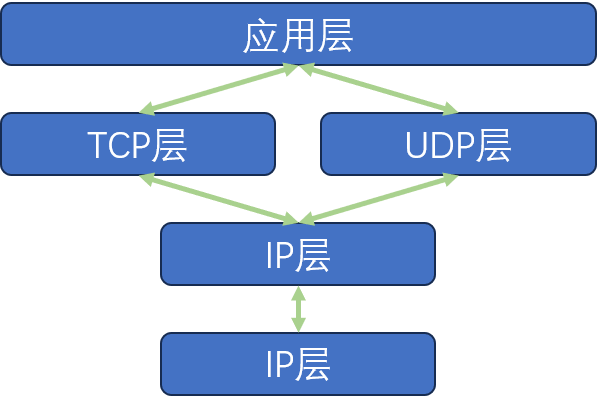
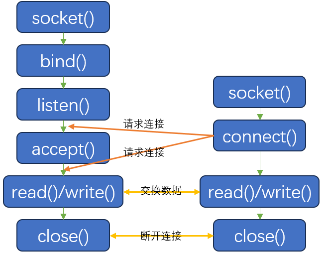

# 基于TCP的服务器端/客户端(1)

## 一、TCP

网络协议分为TCP套接字和UDP套接字。其中TCP是面向连接的，因此又称基于流（stream）的套接字；而UDP面向数据的。

TCP（Transmission Control Protocol），从名字可以看出来它能够对传输过程进行控制。

### 1.1 TCP/IP协议栈



> **[?]** 为啥叫“TCP/IP协议栈”
> 这个协议栈的核心协议是TCP和IP。而UDP是作为作为TCP的补充后续添加进来的，提供不可靠但是轻量的传输。

### 1.2 链路层

链路层负责局部的、点到点的物理传输，依赖的是网口的MAC地址，专门定义LAN、WAN、MAN等网络协议标准。使用的典型机器为交换机。

链路层会将IP层的数据加上源MAC地址和目的MAC地址，同时加上校验序列发送。

链路层提供简单的差错检验；同时支持控制访问，避免多个发送端同时往数据链路上发送数据发生冲突。

### 1.3 IP层

IP层则是负责网络上的数据传输，主要依靠的是IP地址，解决的是网络路径选择问题。

**IP层面向消息并且是不可靠的。**

IP层使用的主要设备是路由器。

### 1.4 TCP/UDP层

IP层仅仅关注一个数据包（数据传输的基本单位），并没有全局观。因此如果要传输多个数据的话，IP会独立地发送每个数据，不会存在传输顺序的控制。

## 二、实现基于TCP的服务器端/客户端

### 2.1 TCP服务器端的默认函数调用顺序：

1. [`socket()`]-->创建套接字

2. [`bind()`]-->分配套接字地址

3. [`listen()`]-->等待连接请求状态

4. [`accept()`]-->允许连接

5. [`read()`/`write()`]-->数据交换

6. [`close()`]-->断开连接

### 2.2 进入等待连接请求状态

主要通过下面的接口开始等待连接请求 ：

```C
#include <sys/socket.h>

int listen(int sock, int backlog);
```

**请求连接队列**。函数的第二个接口的含义是连接请求队列的容量，存放的是已经完成TCP三次握手的连接请求。这个时候连接已经建立，但是还没有创建socket对象。

如果连接队列满了，则新的连接请求将会被拒绝。

此外，队列的长度也不是无限大的。一般而言Linux中这个值(SOMAXCONN)的上限是128。

### 2.3 受理客户端连接请求

通过`accept`函数来从请求队列中取出连接，创建socket对象并且返回它的文件描述符。

```C
#include <sys/socket.h>

int accept(int sock, struct sockaddr* addr, socklen_t* addrlen);
```

### 2.4 TCP客户端的默认函数调用顺序

1. [`socket()`]-->创建套接字
2. [`connect()`]-->请求连接
3. [`read()` \ `write()`]-->交换数据
4. [`close()`]-->断开连接

很明显，和服务器端关键的不同是请求连接操作：

```C
#include <sys/socket.h>

int connect(int sock, struct sockaddr* servaddr, socklen_t addrlen);
```

这个函数在下面两中情况下才会返回：

- 服务器端接受连接请求（将连接请求记录到等待队列）
- 断网等异常情况导致连接请求中断

`connect`函数会自动为客户端socket分配IP和端口号。

### 2.5 基于TCP的服务器端/客户端函数调用关系

下图中给出了TCP连接下，服务器端和客户端之间的交互过程：




