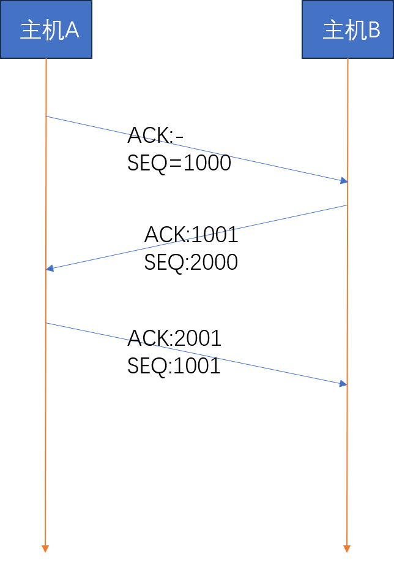
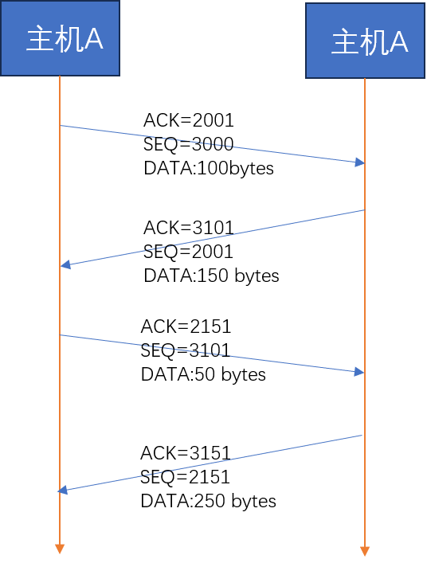
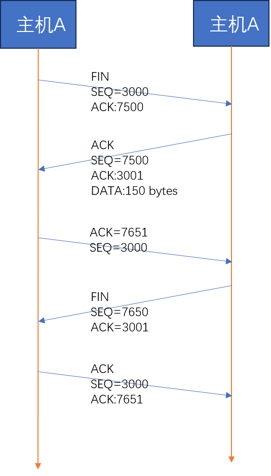

# 基于TCP的服务器端/客户端（2）

## 一、TCP原理

### 1.1 TCP套接字的I/O缓冲

使用`write`往套接字写入数据并不会立即发送，`read`调用后也不是立马接受数据。更准确地说：

- **`write`函数是将数据移送到输出缓冲**。它会在数据移送到输出缓冲之后返回
- **`read`函数则是从输入缓冲中读取数据**

这种缓冲数据结构具有以下特性：

1. I/O缓冲在每个套接字单独存在
2. I/O缓冲在套接字创建的时候自动生成
3. 即使关闭套接字，输出缓冲中的数据依然会被发送
4. 关闭套接字，输入缓冲中的数据将会被丢失

会不会出现发送方发送太多数据导致接收方无法接收全部而出现数据溢出？答案是不会：**TCP使用了滑动窗口协议来协调发送方发送的数据的大小**。

### 1.2 TCP连接（三次握手）

下图演示了如何TCP是如何进行三次握手的：

### 1.3 TCP数据传输

TCP采用的是全双工的数据传输，每一个方向都维持这一个SEQ+ACK序列。

### 1.4 TCP断开连接（4次挥手）

由于TCP是全双工的，因此断开连接在两个方向上都断开，不能一方直接断开。

