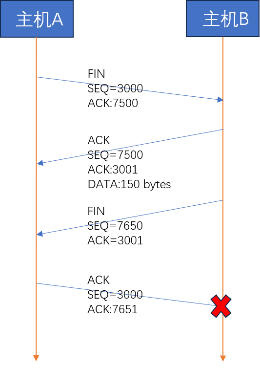
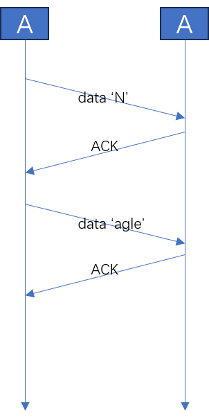
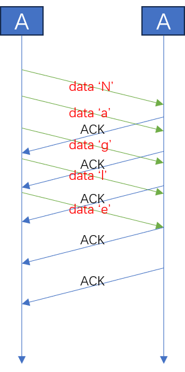

# 套接字的选项

## 一、套接字可选项和I/O缓冲大小

### 1.1 可选项

下面表给出了套接字的一些可配置的选项：

|协议层|选项名|读取|设置|
|:-|:-|:-|:-|
|`SOL_SOCKET`|`SO_SNDBUF`<br>`SO_RCVBUF`<br>`SO_REUSEADDR`<br>`SO_KEEPALIVE`<br>`SO_BROADCAST`<br>`SO_DONTROUTE`<br>`SO_OOBINLINE`<br>`SO_ERROR`<br>`SO_ERROR`|✔<br>✔<br>✔<br>✔<br>✔<br>✔<br>✔<br>✔<br>✔<br>|✔<br>✔<br>✔<br>✔<br>✔<br>✔<br>✔<br>❌<br>❌|
|`IPPROTO_IP`|`IP_TOS`<br>`IP_TTL`<br>`IP_MULTICAST_TTL`<br>`IP_MULTICAST_LOOP`<br>`IP_MULTICAST_IF`|✔<br>✔<br>✔<br>✔<br>✔<br>|✔<br>✔<br>✔<br>✔<br>✔<br>|
|`IPPROTO_TCP`|`TCP_KEEPALIVE`<br>`TCP_NODELAY`<br>`TCP_MAXSEG`|✔<br>✔<br>✔<br>|✔<br>✔<br>✔<br>|

### 1.2 `getsockopt` & `setsockopt`

可选项的设置和获取通过下面主要通过下面两个函数：

- **获取**

```c
#include <sys/socket.h>

int                         //成功返回0，失败返回-1
getsockopt(
    int sock,               //套接字文件描述符
    int level,              //查看的协议层
    int optname,            //查看的选项名
    void* optval,           //保存查看结果
    socklen_t* optlen       //写入第四个参数的大小。
);
```

- **配置**

```c
#include <sys/socket.h>

int                         //成功返回0，失败返回-1
setsockopt(                 
    int sock,               //套接字文件描述符
    int level,              //设置的协议层
    int optname,            //要更改的协议层名称
    const void* optval,     //新的属性值
    socklen_t optlen        //`optval`的大小
);
```

### 1.3 `SO_SNDBUF` & `SO_RCVBUF`

这两个选项是设置输出和输入缓冲大小的。

不过，我们设置的值并不一定会被完全采纳，而只是作为一个提示作用。

## 二、`SO_REUSEADDR`

### 2.1 地址分配错误

在编写服务器的时候，有时候会遇见这样的问题：如果强制终止服务器的话，会发现如果立马重新启动服务器，会在`bind`函数上失败。

这里失败的条件是：

- 先断开服务器
- 短时间内立即重启服务器

如果经过了一段时间之后重启的话，就一切正常的。

这一切的原因在于TCP套接字的四次挥手过程——

### 2.2 Time-wait状态

TCP的四次挥手包括双向的FIN-ACK过程。如果最后的那一次FIN的ACK包发送失败的话，会发生什么？



- **A** 很显然，A不能发了之后直接断开，因为它需要保证它发送的ACK被B接收到了
- **B** B在没有接收到ACK的情况下，需要重新发送FIN包

A如何确认它发送的ACK是否到达B呢？答案很简单：

既然B没有收到ACK的情况下会重传FIN，那么A只需要等一段时间即可。如果收到了FIN，那就说明B没收到，重新发一遍ACK；如果没有收到的话，则说明B已经收到了，不用再发。

因此对于A而言，它需要做的就是发送了ACK之后进入一个Time-wait的状态，等待一段时间之后看看B会不会重新发送FIN。

这一切动作都是操作系统完成的，我们关闭Socket之后，操作系统会让底层的连接继续等待一段时间。

好的，现在我们可以来回答上面的两个问题了：

- **为什么要是先断开服务器？**

很容易注意到：**先发送FIN尝试断开连接的套接字是那个需要进行Time-wait阶段的**

因此答案很简单：我们先关闭服务器的话，则服务器的地址会进入Time-wait状态，立即重启服务器，会重新`bind`到相同的地址，所以会失败。

如果我们先关闭客户端的话，其实客户端的套接字也会进入Time-wait状态。但是下次重启客户端的时候，随机分配端口，不会企图`bind`同一个地址，因此不会有问题。

- **为什么需要过一段时间**

答案显而易见：等待服务器的socket结束time-wait阶段

基于这个原理，我们可以知道：**大概需要经过数据一个来回的Time-wait时间**
### 2.3 地址再分配

[好文链接](https://cloud.tencent.cn/developer/article/1484223?from=15425&frompage=seopage)

有时候我们可能并不希望进行Time-wait操作，例如在服务器宕机的情况下，希望快速重启。

我们可以通过设置套接字的`SO_REUSEADDR`属性为1，使得bind可以重复绑定到一个地址（IP+端口）。

不过，有以下限制需要注意：

- 如果一个地址被正在listen的socket使用，则加上这个参数也不能重用这个地址
- 如果一个socket绑定的是ip是`INADDR_ANY`，则加上这个参数也不能绑定任何使用这个端口号的地址

## 三、`TCP_NODELAY`

### 3.1 Nagle算法

Nagle算法作用在TCP层，作用是优化小数据量的传输场景：在Nagle算法关闭的情况下，TCP的输出缓冲接收到数据之后就会立即发送出去；而启用了Nagle算法之后，则会尽量累计输出缓冲数据，在满足下面的条件之后再发送：

> 试想：如果每一个TCP数据发送的都是一个字节的有效数据，则TCP的头占了40个字节，有效载荷非常小。因此一次性累计多个数据在一个TCP报文中发送是一个很直观的优化方法。

1. 包长度够长了（达到了MSS大小）
2. 包设置了FIN
3. 接收到了之前数据的ACK消息
4. 设置了TCP_NODELAY
5. 超时了

- 开启Nagle算法



- 关闭Nagle算法



### 3.2 禁用Nagle算法

Nagle算法并不是什么时候都适用的。

Nagle算法会和TCP延迟确认产生冲突：Nagle算法和接收方互相等待。

> **TCP延迟确认**:TCP延迟确认也是一种优化策略：收到数据包之后不立即发送ACK，而是等待一段时间。如果不需要发送新的数据了，则单独发送一个ACK；如果有新的数据需要回传，则将ACK加入到数据一起发送回去。这样的话能够显著减少网络上的ACK数量

另外，如果我们发送的是大数据包，则能够保证每一条报文的载荷是足够的，这个时候没必要开启Nagle算法，这样能够减少延迟。

我们只需要将`TCP_NODELAY`设置为1，即可关闭Nagle算法：

```C
int opt_val=1;
setsockopt(sock, IPPROTO_TCP, TCP_NODELAY, (void*)&opt_val, sizeof(opt_val));
```
