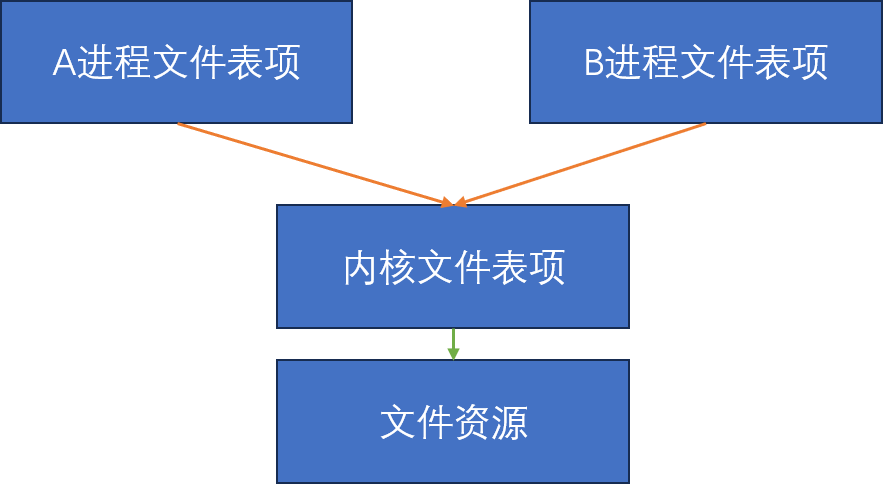

# 多进程服务器端

## 一、进程

### 1.1 并发服务器实现方法

- **多进程服务器**：创建多个进程提供服务(不太适合Windows)
- **多路复用服务器**：捆绑并统一管理I/O对象提供服务
- **多线程服务器**：生成与客户端等量的线程提供服务

### 1.2 进程

**进程**：“占用内存空间正在运行的程序”

### 1.3 进程ID

每个进程在创建的时候都会被操作系统赋予一个唯一的ID（值>1，因为1分配给了操作系统启动后的首个进程）

使用`ps aux`查看所有的进程信息：

- `ps`: process status
- `a` : all
- `u` : user
- `x` : (补充没有控制终端的守护进程)

### 1.4 创建进程

使用下面的函数创建进程：

```c
#include <unistd.h>
pid_t           //成功返回进程ID，失败返回-1
fork(void);
```

`fork`出来的进程会从`fork`调用的返回点开始执行。父子进程通过`fork`的返回值判断：

- 父进程：`fork`返回子进程ID
- 子进程：`fork`返回0

> `fork`函数会拷贝父进程的一些资源，但不是所有资源（例如PID，信号、计时器等）；同时，拷贝也不是直接全部拷贝，而是写时复制（COW）；另外，有一些文件描述符等也只是拷贝引用，而不是真的拷贝文件。

## 二、进程与僵尸进程

### 2.1 僵尸进程

如果父进程创建子进程之后没有手动销毁它，则在父进程的生命周期内子进程会一直处于活着的状态，占用系统资源。

> **[NOTE]** 子进程如果没有被父进程使用`wait`和`waitpid`函数回收，则会在父进程结束时候被系统的systemd进程接管。systemd进程会自动的清理僵尸进程。因此，分为两个情况：<br>
> **1.子进程先于父进程结束**：子进程会一直存在，直到父进程结束，被systemd进程接管；systemd进程会理解释放该僵尸进程<br>
> **2.子进程后于父进程结束**：父进程结束之后子进程就会被systemd进程接管，它结束之后就被systemd进程立即回收了

### 2.2 产生僵尸进程

有两个方法可以终止当前进程：

1. 传递参数调用`exit`函数
2. `main`函数中执行`return`语句

但是，子进程在调用任何这两个方法之后都不会被销毁。

**操作系统只会在将子进程通过这两个方法返回的值传递给父进程之后才会将子进程销毁。**

### 2.3 销毁子进程1：`wait`

```c
#include <sys/wait.h>

pid_t               //成功返回子进程的ID，失败返回-1
wait(
    int* statloc    //存放子进程`exit`或者`return`返回的值以及其他额外的相关信息
);
```

这个函数会阻塞地等待一个子进程结束。如果有没有结束的子进程会一直等待；如果没有子进程则直接退出。

> 每次只能`wait`一个随机的子进程。如果有多个子进程的话，需要多次`wait`

通过下面两个宏来判断返回值：

- `WIFEXITED`：子进程正常终止时返回1
- `WEXITSTATUS`：获取子进程的返回值

### 2.4 销毁子进程2：`waitpid`

`wait`函数会导致进程等待，我们可以使用`waitpid`函数，该函数支持不阻塞。

```c
#include <sys/wait.h>

pid_t
waitpid(
    pid_t pid,          //等待终止的目标子进程ID。传递-1则和wait函数相同，等待任意进程终止
    int* statloc,       //存放子进程结束的返回值及其他相关数据
    int options         //额外选项
);
```

如果我们在`options`选项中使用`WNOHANG`，则没有终止的子进程也不会进入阻塞，而是返回0并且退出

## 三、信号处理

### 3.1 向操作系统请求处理

子进程终止的识别主体是操作系统。我们可以通过信号处理（Signal Handling）机制来响应子进程终止事件。

> 信号发生之后，操作系统会唤醒调用`sleep`函数进入睡眠的进程

### 3.2 信号与`signal`函数

```C
#include <signal.h>
void (*signal(int signo, void(*func)(int)))(int);
```

我们可以通过上面这个函数向操作系统注册信号处理回调。常用的信号常数有：

- `SIGALRM`: 在`alarm`函数注册的时钟超时
- `SIGINT`: 输出Ctrl+C
- `SIGCHLD`: 子进程终止

例如：

```c
signal(SIGCHLD, onChildProcessEnd);
signal(SIGALRM, onTimeout);
signal(SIGINT, onKeyControl);
```
下面是`alarm`函数定义：

```C
#include <unistd.h>

unsigned int                //返回0或者以秒为单位的距SIGALRM信号发生所剩余时间。
alarm(
    unsigned int seconds    //如果传入正整数，则响应秒数后将产生`SIGALRM`信号；传入0则取消之前的预约
);
```

### 3.3 `sigaction`函数

`sigaction`函数类似于`signal`函数，可以完全替代后者，并且更加稳定：

> `signal`函数在UNIX系列的不同操作系统中可能存在区别，但是`sigaction`函数则完全相同

```c
#include <signal.h>

struct sigaction{
    void(*sa_handler)(int);
    sigset_t sa_mast;                   //使用sigemptyset来置0
    int sa_flags;                       //设置为0
};

int                                     //成功返回0，失败返回-1
sigaction(
    int signo,                          //监听的信号值
    const struct* sigaction* act,       //信号处理函数
    struct sigaction* oldact            //接收之前注册的四年好处理函数
);
```
这种模型的逻辑很简单：

- 由主进程负责监听
- `accept`新的连接之后，进行`fork`，在子进程对连接进行处理
## 四、基于多任务的并发服务器

### 4.1 基于进程的并发服务器模型

这种模型的逻辑很简单：

- 由主进程负责监听
- `accept`新的连接之后，进行`fork`，在子进程对连接进行处理

### 4.2 通过`fork`函数复制文件描述符

在我们使用`fork`函数创建子进程的时候，父进程的所有资源都会被拷贝一份。那么像套接字这种的文件描述符的也是完全拷贝了吗？这样的话岂不是存在两个绑在同一个<ip,port>的套接字了？

实际上，套接字文件描述符只是对操作系统中的套接字的引用，`fork`之后只是引用拷贝了一份，操作系统中的套接字本身还是只有一份。

> **[NOTE]子进程拷贝了之后意味着一个套接字存在两个引用。但是这里的“引用”其实只是一个`int`类型的数值。既然如此，父进程close了该文件描述符，但是因为它手里的`int`仍然是有效的值，而因为子进程的引用仍然存在，父进程能否继续使用该套接字？**
> <br>答案是**不能**！对于文件描述符，Linux下是三层结构：
> 
> 我们在父进程`close`一个文件描述符的时候，它进程独占的文件表项被删除，即使它手里拿着的文件描述符仍然是旧值，但是已经无法通过进程独占的文件表项访问内核文件表项了。

## 五、分割I/O的TCP程序

我们可以将接收网络数据和发送网络数据作为两个独立的部分分开在两个进程中执行，这样可以提升网络吞吐量。


