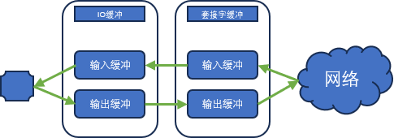

# 套接字和标准I/O

## 一、标准I/O函数的优点

### 1.1 两个优点

- 标准I/O具有良好的可移植性
- 标准I/O可以利用缓冲提高性能

对于TCP套接字来说，因为套接字本身也会存在一个缓冲，如果我们在TCP套接字上使用标准IO的话，数据会经过两个缓冲：




## 二、使用标准I/O

我们在Linux下使用操作系统的接口打开的文件、创建的套接字，返回的都是文件描述符。我们无法直接在文件描述符上使用标准I/O函数。因此我们需要将文件描述符转为`FILE`指针。

### 2.1 `fdopen`函数将文件描述符转为`FILE`结构体指针

```c
#include <stdio.h>

FILE*                       //成功返回转换的FILE指针
fdopen(
    int         file_des,   // 需要转换的文件描述符
    const char* mode        //创建的FILE指针的模式信息，和fopen一样
);

```

### 2.2 `fileno`函数反向转换

```c
#include <stdio.h>

int fileno(FILE* stream);
```

这个函数将`FILE`指针转为文件描述符。

## 三、基于套接字的标准I/O使用

在Linux下，套接字同样是文件描述符，因此我们可以将之转为标准I/O的`FILE`结构体指针，使用标准I/O操作。
