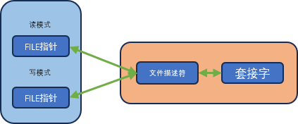
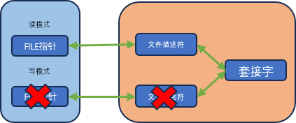

# 关于I/O流分离的其他内容

## 一、分离I/O流

分离I/O的核心思想是将输入和输出分开，避免在一个对象上同时执行输入输出。

### 1.1 2种分离方法

我们目前实现了两中I/O流分离的方法：

- **多进程**分离：通过`fork`函数拷贝文件描述符，父子进程各自分别负责读取；虽然套接字只有一个，但是在不同进程下只发挥了一项功能。
- **在一个文件描述符上分别创建文件写`FILE`指针和文件读`FILE`指针** :一个指针专门负责写入，一个指针专门负责读取

### 1.2 I/O分离带来的`EOF`问题

我们可以在套接字描述符上使用`shutdown`函数关闭单个方向的数据流。如果我们使用`fdopen`方法创建`FILE`指针的话，怎么实现半关闭呢？

因为我们可以直接在一个描述符上分别创建`"w"`和`"r"`标识的读写`FILE`指针，因此一个很直觉的判断是：只要在用`"w"`标记的`FILE`指针上调用`fclose`，即可单方便关闭写入流。

然而事实是这种做法不可行。**`fclose`函数会直接关闭整个文件描述符，不会因为标签为`"w"`或者`"r"`就实现关闭单向流**。

> 事实上，`fdopen`第二个参数和`fopen`的第二个参数是一样的，只是描述`FILE`指针的模式，与流的方向性无关。因此企图通过关闭使用`"w"`标记的`FILE`指针来关闭输出方向的流，从语义上就是错误的。

## 二、文件描述符的复制与半关闭

### 2.1 终止“流”时无法半关闭的原因

下图中描述了我们前面一节对于半关闭的一种尝试：



可以看见，两个`FILE`指针关联的是一个文件描述符。关闭任意一个`FILE`指针都会导致文件描述符被关闭；一旦文件描述符被关闭，则无论是都还是写都会失败。


难道没有办法了吗？

当然有！**我们可以复制文件描述符**。

在讲通过`fork`来进行IO分流的时候，我们讲过：`fork`之后文件描述符会被拷贝一份。不过，文件描述符只是对底层套接字资源的一个引用，因此底层的套接字不会被拷贝；只有关闭所有的文件描述符之后底层的套接字资源才会被释放。

因此，我们可以拷贝两个文件描述符，每个文件描述符都关联到一个`FILE`指针，每个`FILE`指针使用不同的IO模式：



然而，这样显然并没有实现所谓的半关闭。甚至`fclose`一个`FILE`之后，另一个文件描述符仍然支持读写，连全关闭都没有。

不过，在真正利用复制文件描述符实现半关闭之前，让我们先来看看怎么复制文件描述符。


### 2.2 复制文件描述符

所谓的复制文件描述符，是指**创建**另一个文件描述符，使之能够访问同一个底层文件。

注意这里的**创建**，而是新建另一个引用同一个文件的文件描述符。新建的文件描述符拥有不一样的值。

复制使用的接口为`dup`和`dup2`：

```c
#include <unistd.h>

int                 //创建成功返回复制的文件描述符，否则返回-1
dup(
    int file_des    //需要复制的文件描述符
);

int                 //创建成功返回复制的文件描述符，否则返回-1
dup2(
    int file_des,   //需要复制的文件描述符
    int file_des2   //明确指定的文件描述符整数值，要求属于 (0, 最大文件描述符值)
);
```

### 2.3 复制文件描述符之后流的分离

现在我们拷贝了文件描述符，该怎么分离流呢？

答案很简单：

```c
shutdown(fileno(write_fp));
fclose(write_fp);
```

> 其实我们不拷贝文件描述符，也可以通过`shutdown(fileno(write_fp))`的方法来关闭单向流。但这里更重要的是流的分离：我们手动建立了两个文件描述符，一个负责写，一个负责读，并且同时将它们转为标准IO的`FILE`指针处理

## 三、关于文件描述符的补充

文件描述符是一个整型值，没有所谓的方向性，只有可读可写的权限:

- `O_RDONLY`
- `O_WRONLY`
- `O_RDWR`

除了这三个基本读写权限外，还有下面这些附加选项：

- `O_APPEND`：追加写
- `O_CREAT`： 不存在则创建
- `O_TRUNC`：清空文件
- `O_NONBLOCK`：非阻塞
- `O_SYNC`：同步写入

我们在通过`open`函数创建的时候，可以传入这些flag来决定新建的描述符的读写权限。

通过`socket()`套接字创建的描述符默认是`O_RDWR`权限。
