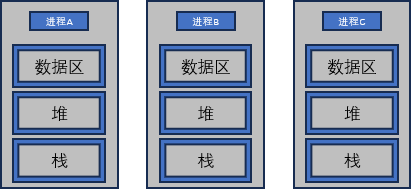
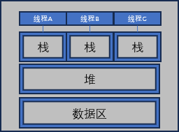

# 多线程服务器端的实现

## 一、理解线程概念

### 1.1 为什么引入线程

创建进程的工作对操作系统带来相当沉重的负担；同时每个进程独享内存空间，所以进程间通信比较困难复杂。另外，上下文切换是使用进程的时候最大的开销。

使用线程具有如下优点：

1. 线程上下文切换开销更小
2. 线程间数据通信无需特殊技术

### 1.2 进程和线程之间的差别

每个进程的内存空间都由保存全局变量的数据区、堆区以及栈区构成，多个进程的内存结构如图：



而采用多线程的话，则内存结构如图：



这意味着线程切换：

- 不需要切换数据区和堆区
- 可以直接利用数据区和堆区交换数据

## 二、线程的创建、运行

POSIX（Portable System Interface for Computer Environment）是为了提高UNIX系列操作系统间的移植性而制定的API，我们创建线程使用也是POSIX标准的接口。

### 2.1 线程的创建和执行流程

```c
#include <pthread.h>

int                                                 //成功返回0，失败返回其他值
pthread_create(
    pthread_t * restrict                thread,     //保存新创建的线程的ID
    const pthread_attr_t*   restrict    attr,       //传递线程属性的参数，传递NULL表示床架按默认属性的线程
    void*(*start_routine)(void*),                   //线程主函数
    void* restrict                      arg         //传递给第三个参数的参数
);
```

> `restrict`关键字只能修饰指针，表示的是在这个指针的声明周期内，不会有其他指针访问该指针指向的内存

我们可以通过下面的函数来让当前线程等待指定线程执行结束：

```c
#include <pthread.h>
int                     //成功返回0，失败返回其他值
pthread_join(
    pthread_t thread,   //需要等待的线程id
    void** status       //保存线程函数返回值的指针变量的地址
);
```
我们可以通过下面的函数将线程分离，使其自动执行，结束之后的资源由系统自动回收：

```c
#include <pthread.h>

int pthread_detach(
    pthread_t   thread
);
```

### 2.2 线程安全函数

多个线程调用同一个函数可能会导致问题，这些函数内部可能存在临界区。

幸运的是，大部分标准函数都是线程安全的函数。另外，我们也不需要自己区分线程安全和非线程安全函数。Linux（Windows也是）在定义非线程安全函数的时候同时提供和了具有相同功能的线程安全的函数。

例如对于函数`gethostbyname`，同时有线程安全的版本`gethostbyname_r`。

线程安全的函数一般以`_r`结尾（这与Windows不同）。不过我们不需要手动将所有调用都改为`_r`版本。我们可以在引入头文件之前定义宏`_REENTRANT`。

定义`_REENTRANT`宏的核心作用：

- 将`errno`从全局变量改为线程局部存储
- 将某些非可重入的函数（例如`strtok`、`asctime`、`rand`等）改为可重入的版本
- 调整`stdio`函数的内部锁机制，使`printf`、`getchar`改为线程安全的

> 从glibc 2.3开始，不需要显式定义，使用`-lpthread`编译的时候，编译器会自动定义它


## 三、线程同步

### 3.1 互斥量

互斥量（Mutual Exclusion，`mutex`）是保护临界区的一种加锁机制。

- **创建互斥量**

```c
#include <pthread.h>
int                                     //创建成功返回0，失败返回其他值
pthread_mutex_init(
    pthread_mutex_t*            mutex,  //保存互斥量变量的地址
    const pthread_mutexattr_t*  attr    //创建的互斥量的属性，没有特别需要制定则传入NULL
);
```

- **销毁互斥量**
```c
#include <pthread.h>
int                                     //成功返回0，失败返回其他值
pthread_mutex_destroy(      
    pthread_mutex_t*    mutex           //需要删除的互斥量
);
```

- **加锁**

```c
#include <pthread.h>

int                                     //成功返回0，失败返回其他值
pthread_mutex_lock(
    pthread_mutex_t*    mutex           //需要加锁的mutex
);
```

- **解锁**
```c
#include <pthread.h>
int                                     //成功返回0，失败返回其他值
pthread_mutex_unlock(
    pthread_mutex_t*    mutex           //需要解锁的mutex
);
```

### 3.2 信号量

- **创建信号量**

```c
#include <semaphore.h>

int                             //成功返回0，失败返回其他值
sem_init(
    sem_t*          sem,        //存放初始化的信号量
    int             pshared,    //0：只允许一个进程内部使用；其他值表示可以在多个进程之间共享的信号量
    unsigned int    value       //新创建的信号量初始值
);
```

- **销毁信号量**
```c
#include <semaphore.h>

int                     //成功返回0
sem_destroy(
    sem_t*      sem     //需要销毁的信号量
);
```

- **增加信号量的值**
```c
#include <semaphore.h>
int
sem_post(
    sem_t*      sem     //信号量+1
);
```

- **减少信号量的值**

```c
#include <semaphore.h>
int
sem_wait(
    sem_t*      sem     //递减的信号量
);
```
