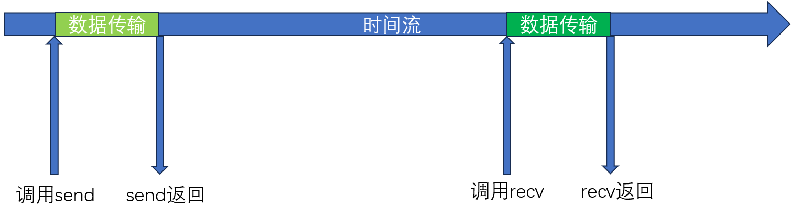
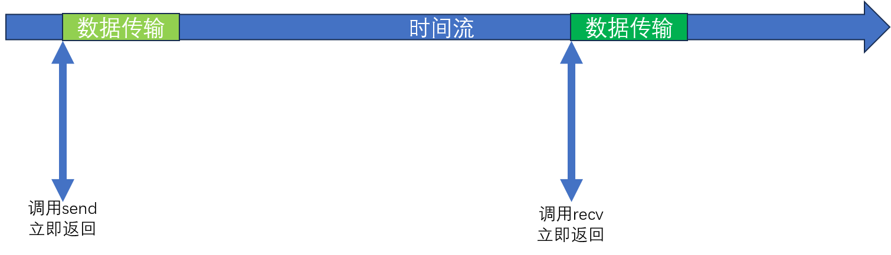

# 异步通知I/O模型

**<font color="red"> 本章的异步是指通知，而非IO</font>**

## 一、理解异步通知I/O模型

### 1.1 同步和异步

`send`函数只有在数据被传输到输出缓冲之后才会返回，`recv`只有读取到数据之后才会返回。这种情况执行的就是同步IO：IO进行时无法执行其他操作。



异步IO则完全相反：请求IO之后立即返回，不会等待IO结束：



### 1.2 理解异步通知IO模型

这个模型的关键点是：

1、异步
2、通知

“通知”即如果需要发送或者接收数据的话，操作系统会通过接口通知开发者。`select`函数就是典型的通知IO。

但是`select`是同步的通知IO：只有在IO就绪的时候`select`才会返回。

异步通知IO则不同：这种模式下，指定监视之后就立即返回，后面再来查询状态是否变化。

> 其实`select`函数也可以是异步的：我们可以设置超时时间。超时后无论IO是否可用都会返回。

## 二、实现异步通知IO模型

异步通知IO的实现方法有两种：

- `WSAEventSelect`
- `WSAAsyncSelect`

这里只介绍第一种。


### 2.1 `WSAEventSelect` 函数和通知

```c
#include <winsock2.h>

int                                 //成功返回0，失败返回SOCKET_ERROR
WSAEventSelect(
    SOCKET          s,              //需要监听的套接字句柄
    WSAEVENT        hEventObject,   //传递事件句柄以验证事件发生与否
    long            lNetworkEvents  //希望监视的事件类型信息
);
```

这个函数的作用是设置监听目标套接字。只要参数`lNetworkEvents`指定的任何事件发生，则将`hEventObject`内核对象改为signaled状态。

第三个参数可以用位运算组合下面的事件类型：

- `FD_READ`     : 是否可以接收数据？
- `FD_WRITE`    : 是否以非阻塞的方法传输数据？
- `FD_OOB`      : 是否收到OOB数据？
- `FD_ACCEPT`   : 是否有新的连接请求？
- `FD_CLOSE`    : 是否有断开连接请求？

### 2.2 manual-reset模式事件对象的其他创建方法

我们可以使用`CreateEvent`创建一个事件，并且支持指定是否是manual-reset还是auto-reset以及初始状态是signaled还是non-signaled。我们可以直接用下面的接口创建一个manual-reset + non-signaled对象：

```c
#include <winsock2.h>

WSAEVENT            //就是一个HANDLE
WSACreateEvent();
```

> 这个函数本质上就是调用CreateEvent创建一个manual-reset+non-signaled的事件对象

相应的我们可以用下面的接口关闭它：

```c
#include <winsock2.h>

BOOL
WSACloseEvent(
    WSAEVENT    hEvent
);
```

### 2.3 验证是否发生事件

我们设置监听之后，可以在后面使用下面的接口来验证是否发生了事件：

```c
#include <winsock2.h>

DWORD                                       //成功返回事件的对象信息，失败返回WSA_INVALID_EVENT
WSAWaitForMultipleEvents(
    DWORD                   cEvents,        //第二个参数中的数据个数
    const WSAEVENT*         lphEvents,      //事件句柄数组
    BOOL                    fWaitAll,       //是否等待所有事件对象变为signaled状态
    DWORD                   dwTimeout,      //超时，1/1000s为单位
    BOOL                    fAlertable      //是否进入alertable wait（可警告等待）状态
);
```

如果有任何事件发生，我们将函数的返回值减去`WSA_WAIT_EVENT_0`得到的数值就是参数`lphEvents`数组中最小的变为signaled的事件句柄的下标。

> 这里最多只能传递64个事件对象，具体查看`WSA_MAXIMUM_WAIT_EVENTS`宏定义

##### 我们如何得到所有signaled事件？

因为`WSAEVENT`对象是manual-reset的，这意味着在`WSAWaitForMultipleEvents`函数返回之后它们不会被设置为non-signaled，所以我们可以利用循环，调整第二个参数数组的起始地址来反复查询。

##### 为什么这里是异步的？

这里看上去和`select`非常类似。为什么`select`函数是同步的而这个是异步的？原因是`select`注册监听和等待事件发生是一个动作，即`select`调用包括注册监听和等待事件发生，因此调用之后立即进入阻塞态，而这里注册监听的动作会立即返回，只有我们真的需要结果的时候才来调用查询。

### 2.4 区分事件类型

我们查询返回之后，需要知道具体发生了什么事情。可以使用下面的接口：

```c
#include <winsock2.h>

int                                         //成功返回0，失败返回SOCKET_ERROR
WSAEnumNetworkEvents(
    SOCKET              s,                  //发生事件的套接字
    WSAEVENT            hEventObject,       //关联到套接字的Event对象
    LPWSANETWORKEVENTS  lpNetworkEvents     //存储发生的事件信息
);

typedef struct _WSANETWORKEVENT
{
    long                lNetworkEvents,
    int                 iErrorCode[FD_MAX_EVENTS];
}WSANETWORKEVENTS, *LPWSANETWORKEVENTS;
```

发生的事件会以位运算存储在第三个参数的`lNetworkEvents`字段，我们按照下面的方式来查询：

```c
WSANETWORKEVENTS netEvents;
WSAEnumNetworkEvents(hSock, hEvent, &netEvents);
if(netEvents.lNetworkEvents & FD_ACCEPT)
    //...
if(netEvents.lNetworkEvents & FD_READ)
    //...
//...
```

此外，如果发生错误，错误码会放在`iErrorCode`成员中，我们使用相应的`FD_XXX_BIT`作为下标进行查询，例如`netEvents.iErrorCode[FD_READ_BIT]`查询`FD_READ`相关的错误：

```c
if(netEvents.iErrorCode[FD_READ_BIT]!=0)
{
    //...
}
if(netEvents.iErrorCode[FD_WRITE_BIT]!=0)
{
    //...
}

```
