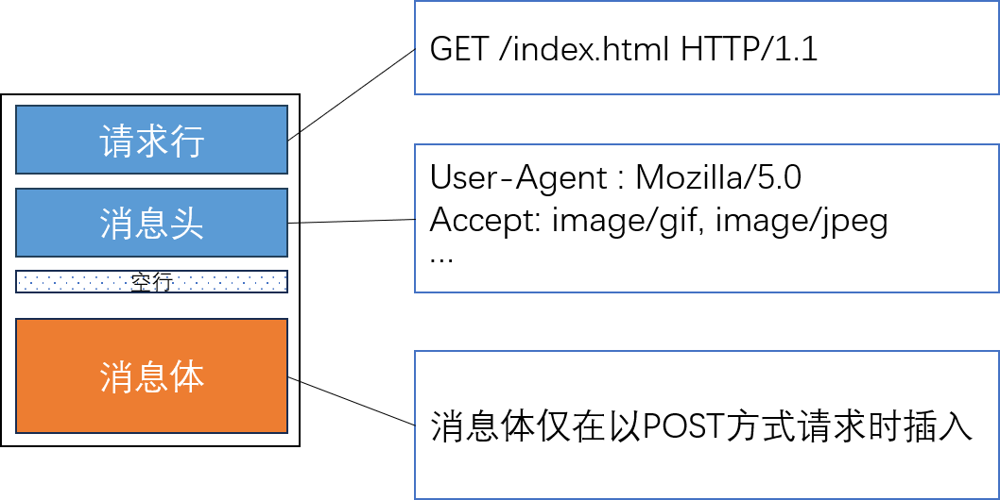
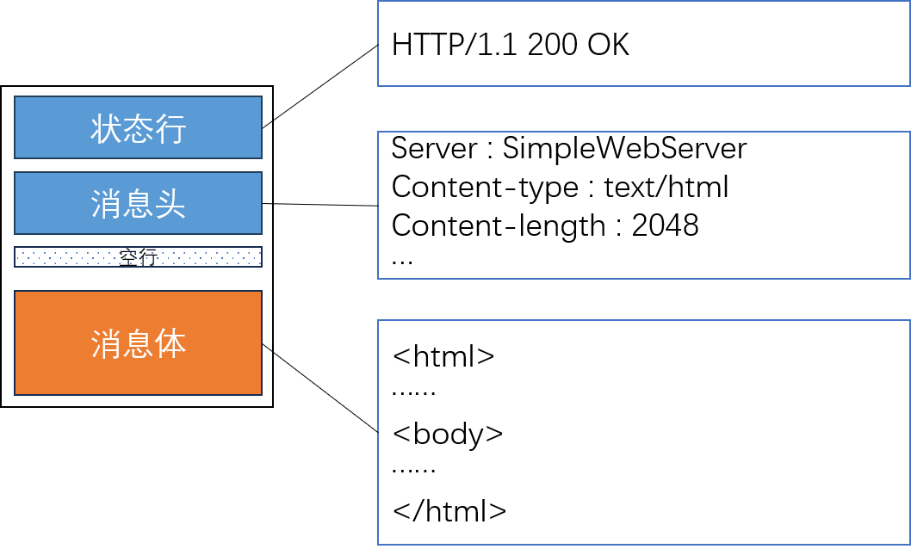

# 制作HTTP服务器端

## 一、HTTP概要

### 1.1 HTTP服务器

简单理解，**基于HTTP协议，将网页对应文件传输给客户端的服务器端** 就是HTTP服务器。

浏览器是一个HTTP客户端，除了对服务器发起HTTP请求外，还支持对HTML文本进行展示。

> **HTTP** Hipertext Transfer Protocol

HTTP协议基于TCP。

Web服务器就是基于HTTP协议传输超文本的服务器端。

### 1.2 HTTP

#### 1.2.1 无状态的Stateless协议

HTTP是一个无状态协议：服务器端响应客户端请求之后立即断开连接，不会维持客户端状态。即使同一个客户端再次发送请求，服务器端也无法辨认。

##### Cookie技术

为了弥补HTTP无法保持连接状态的缺点，Web编程中会使用Cookie技术。Cookie技术借助HTTP协议头来实现：

- **服务器创建并发送Cookie** ：服务器在HTTP响应中通过Set-Cookie头部，指示浏览器存储指定的信息

- **浏览器自动存储并管理Cookie** ：浏览器将收到的Cookie作为文本文件保存在本地，并且遵守其声明周期

- **浏览器自动携带并回传Cookie** ：浏览器每次访问一个服务器的时候，根据其域名、路径等信息自动找到匹配的Cookie，放入HTTP请求的头部发送给服务器

Cookie有以下属性：

|属性|核心作用|重要作用与目的|
|:-|:-|:-|
|`Expires`/`Max-Age`|控制Cookie的生命周期|`Expires`指定过期具体时间点；`Max-Age`设定存在秒数|
|`Domain`/`Path`|限制Cookie的作用范围|决定哪些域名及其子域，以及哪些路径下的请求会携带Cookie|
|`Secure`|确保传输安全|限制Cookie仅在HTTPS加密连接中传输，放置中间人攻击导致泄露|
|`HttpOnly`|放置脚本窃取|进制JavaScript(`document.cookie`)访问Cookie|
|`SameSite`|防御跨站请求伪造|限制第三方网站请求是否发送Cookie；`strict`最严，`lax`允许部分顶级导航|

##### Session

除了使用Cookie，我们还可以使用Session来保存上下文。其作用流程是：

- **创建会话** ：当用户首次访问服务器，服务器会生成一个唯一的SessionID
- **传递Session** ：服务器将Session ID通过Cookie的方法传递给客户端
- **浏览器存储并自动回传**：浏览器保存这个Cookie，在后续请求中自动在Cookie中将SessionID加上
- **服务器查询用户数据** ：服务器根据回传的SessionID，自动查询该用户的数据
- **更新或销毁会话** ：用户操作的时候，服务器会修改Session保存的数据；如果用户退出登录或者会话超时，服务器会删除该会话记录，同时客户端也会收到一个过期指令

### 1.2.2 请求消息（Request Message）结构

HTTP请求的报文结构：

### 1.2.3 响应消息（Response Message）结构

HTTP服务器向客户传递响应消息的结构：

常见的状态码有：

- `200 OK`:成功处理了请求
- `404 Not Found`: 没有找到文件
- `400 Bad Request`: 请求方式有误
